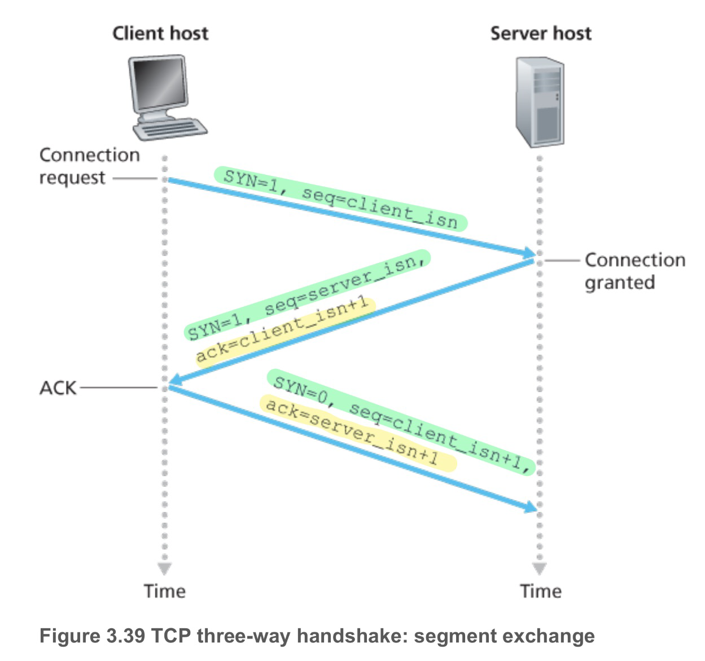
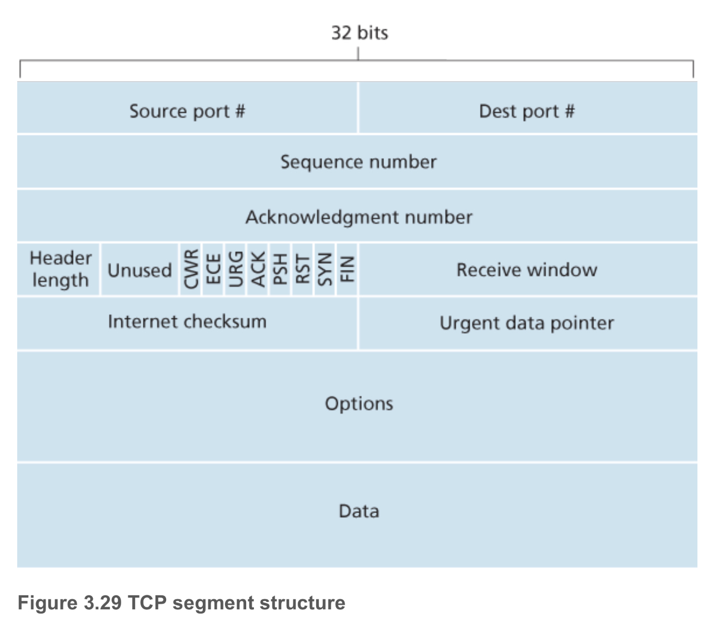
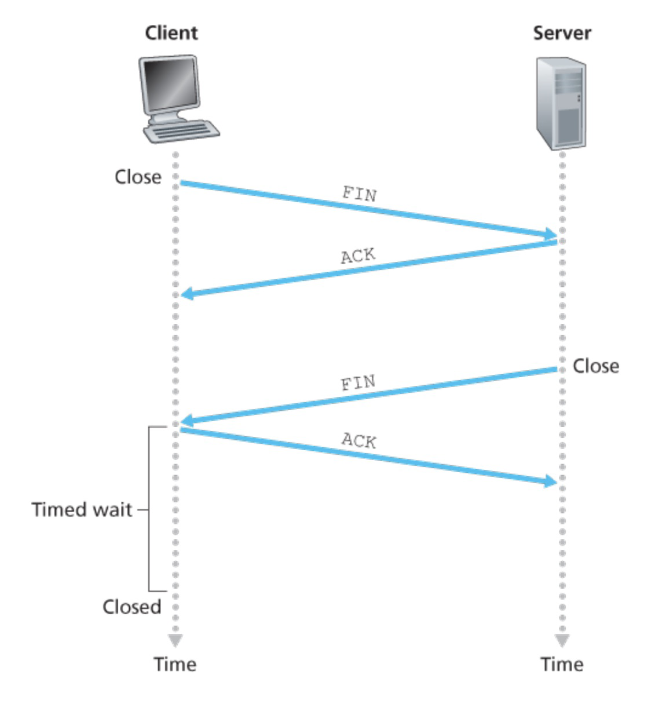
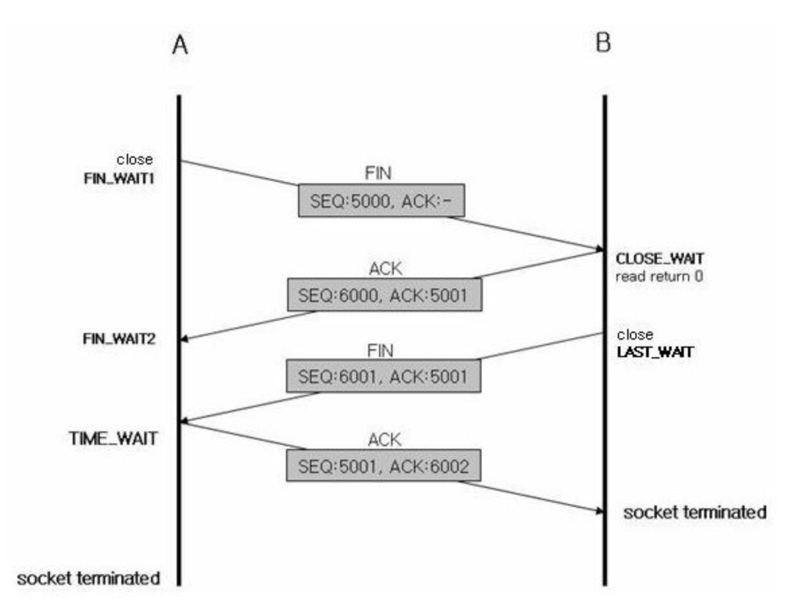

# TCP Handshake

- 왜 그냥 보내는 게 아니고 handshake 과정을 거칠까요?
- 그럼 우선 TCP 통신이란 뭘까요?
- TCP는 unreliable network에서 reliable한 전송을 보장할 수 있게 하는 프로토콜입니다.
- 그렇다면 handshake는 reliable한 전송을 위해 필요하다고 생각해볼 수 있습니다.
  - Q. 굳이 <u>reliable한 전송이 필요가 없다면, handshake를 통해 연결 성립을 해야할까요</u>?


# UDP

- UDP의 경우는 <u>reliable한 전송을 보장하지 않습니다.</u>
- 따라서 UDP는 통신을 하려는 상대방이 지금 메세지를 받을 수 있는 지 없는 지를 확인하지 않고 그냥 보냅니다. 그래서 handshake 과정을 통해 상대방의 상황이 어떤 지, 준비가 되어 있는 지 확인할 필요가 없기 때문에, <u>handshake를 거치지 않습니다</u>.

# TCP: `Transmission Control Protocol` 

- 그렇다면 handshake가 뭐길래 TCP는 reliable한 전송을 보장할 수 있는 걸까요?
- 일단 과정을 살펴보면 알겠죠?
- 우선 handshake는 연결을 성립할 때, 해제할 때 모두 일어납니다.
- 성립할 때는 세번, 해제할 때는 네번 패킷을 주고 받습니다. 그래서 성립할 때는 `3-way handshake`, 해제할 때는 `4-way handshake`가 일어난다고 합니다.
- 그럼 연결을 성립하기 위한 3 way handshake 과정을 먼저 살펴봅시다.

## 3 way handshake: 연결 성립(Connection Establishment)

- 3 way handshake의 핵심은 서로 sequence number를 주고 받으면서 상태를 동기화하는 것



- 우선 데이터를 받고 싶어 하는 호스트(클라이언트) application이 데이터를 갖고 있는 다른 호스트(서버)와 연결을 하고 싶다고 TCP에 알릴 것입니다. 

- 그럼 이제 client의 TCP가 서버의 TCP와 connection을 성립하기 위해 3-way handshake를 진행합니다.

  1. 클라이언트 쪽 TCP가 서버 쪽 TCP에게 `SYN segment`를 보냅니다.

     > ### segment란?
  	 >
     > transport layer에서의 데이터 전송 단위
  	 >
  	 > ### SYN(synchronize) segment?
  	 > TCP 헤더 중에  `SYN bit`를 1로 세팅한 세그먼트 라서 SYN segement라고 합니다.
  	 > 
  	
  	이 때 segment에는, 연결을 요청하는 클라이언트가 선택한 <u>랜덤 sequence number</u>가 포함되어 있습니다. 

  2. 서버는 `SYN segment`를 받고, TCP 버퍼와 연결을 위한 변수들을 할당합니다. 그리고 클라이언트에게 클라이언트가 보낸 SYN segment를 잘 받았다는 의미로 TCP 헤더의 ACK(acknowledgment) 부분을 클라이언트가 보낸 seq # +1로 세팅합니다.

     또, 클라이언트가 서버에게 SYN segment를 보낸 것처럼 역시 서버 자신이 선택한 랜덤 seq #를 담아서 SYN segment로서의 역할도 합니다. 그러면 SYN bit도 1로 세팅되겠죠?

  3. 클라이언트는 서버의 `SYN ACK segment`를 받고, 연결을 위한 버퍼와 변수를 역시 할당합니다. 또 서버의 seq #를 잘 받았다는 의미에서 `ACK segment`를 보냅니다.

- TCP는 양방향 연결이므로, 각자 seq #를 보내고 서로 잘 받았는지 확인하기 위해 SYN ACK segment를 서로 주고받는 것입니다. 근데 서버가 SYN, ACK를 한꺼번에 보내므로 3 way로 handshake가 진행됩니다.

- 위 그림엔 안나와있지만, 이외에도 3 way handshake를 통해 결정되는 데이터가 있습니다. 

  - 오늘날의 TCP는 대부분 flow control을 위해 Stop and Wait 방식 대신 `Sliding Window` 사용합니다. 이 때 사용하는 sliding window의 크기는 three way handsake를 통해 각자 정한 윈도우 사이즈를 주고 받고, 그 외에 네트워크 상황(RTT)을 고려해서 결정됩니다. 네트워크가 좋지 않을 수록 윈도우 크기를 줄이게 됩니다. 

    - 이 때 정한 윈도우 크기는 계속해서 상황에 맞게 변경됩니다.


## 4 way handshake: 연결 해제(Connection Termination)

- 연결 된 후에는 서로 segment를 보내서 데이터를 주고 받을 수 있습니다.
- 후에 연결을 해제하고 싶을 때, 연결된 두 호스트 어디서든 연결을 해제할 수 있습니다. 
- 그리고 연결을 해제하기 위해 4 way handshake 과정이 진행됩니다.






1. 연결을 종료하고 싶은 쪽(위 예에선 클라이언트)에서 header의 <u>FIN bit를 1로 세팅해서 보냅니다</u>. 
2. 서버는 위 segment를 받고, 받았다는 의미로 <u>ACK를 보냅니다.</u> (이 때 보내야 하는 데이터가 남아 있다면 데이터를 보내기 위해 <u>연결을 바로 종료하진 않습니다.</u>)
3. 서버는 데이터를 모두 보낸 후 연결을 종료할 준비가 됐으므로 <u>FIN bit를 1로 세팅해서 보냅니다.</u>
4. 마지막으로, 클라이언트가 서버가 종료했다는 걸 확인했다는 의미로 ACK를 보냅니다. 이 때, **<u>클라이언트는 아직 서버로부터 받지 못한 데이터가 있을 수 있으므로 잠시 기다린 후에 연결을 종료합니다.</u>** 이 때 두 호스트는 연결을 위해 사용했던 resoure를 해제합니다.

---------

> # 생각해봅시다.
>
> <span style="font-size:110%">
>
> 🧑‍🏫 TCP Handshake과정에서, 연결을 성립할 때와 해제할 때, 왜 성립할 때처럼 SYN, ACK 를 같이 보내는 게 아니고, FIN을 보낸 후에 ACK를 보낼까요?
>
>  🙋
>
> </span>
>
> <span style="font-size:110%">
>
>  🧑‍🏫 SYN 패킷을 보낼 때 최초의 sequence number를 ISN(Initial sequence number)라고 합니다. ISN은 랜덤으로 선택된다고 했는데요, 랜덤으로 선택하는 이유가 뭘까요?
>
> 🙋 
>
> </span>
>
> <span style="font-size:110%">
>
> 🧑‍🏫 Dos 공격 방법 중에, 3-way handshake 과정을 이용한 공격 방식이 있습니다. 랜덤 IP의 클라이언트가 계속해서 3-way handshake의 첫번째 SYN 패킷을 보내는 공격인데요. 이게 왜 문제가 되는 걸까요?
>
> 🙋 
>
> </span>


```toc
```

