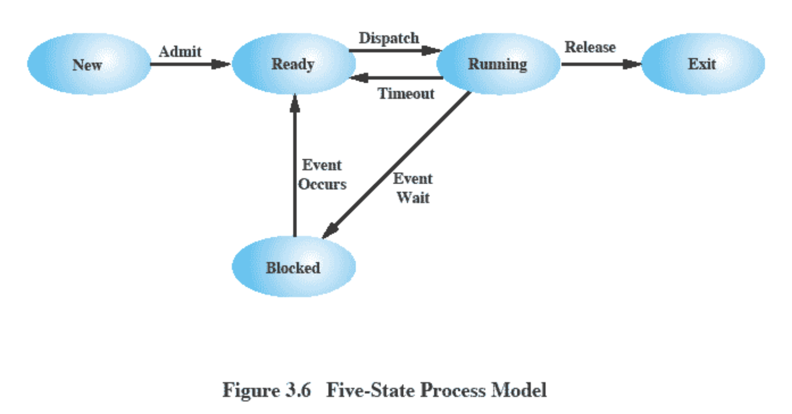

> # 프로세스와 스레드
>
> 1. [프로세스의 개요](https://goldggyul.github.io/os-001-process/)
> 2. [프로세스 제어 블록과 문맥 교환](https://goldggyul.github.io/os-002-pcb/)
> 3. [프로세스의 연산](https://goldggyul.github.io/os-003-process-struct/)
> 4. [스레드](https://goldggyul.github.io/os-004-thread/)
> 5. [[심화학습] 동적 할당 영역과 시스템 호출](https://goldggyul.github.io/os-005-system-call/)

# 프로세스의 개요

## 📌 프로그램과 프로세스

운영체제에서 `프로세스`는 하나의 작업단위입니다. (그래서 프로세스를 `task`라고도 부릅니다.) 사용자가 마우스를 더블클릭하여 `프로그램`을 실행하면 그 프로그램이 프로세스가 되는 겁니다. 그럼 정확히 둘의 차이는 뭘까요?

- 정적인 상태 vs. 동적인 상태
  - 프로그램은 저장장치에 보관되어 있습니다. 그리고 프로그램이 실행된다는 건 프로그램 코드가 `메모리`에 올라와서 작업이 진행되는 것입니다. 그리고 이렇게 메모리에 올라온 것이 프로세스라고 할 수 있습니다. 
- 프로그램은 작업 절차를 쭉 적어놓은 것이고, 프로세스는 그 작성된 작업 절차를 실제로 실행하는 것입니다.
  - 예를 들자면, 요리할 때 레시피를 보고 레시피를 순서대로 실행하면서 요리를 하는 것과 같습니다. 이 때 레시피가 프로그램이고, 요리를 하는 것은 프로세스가 명령을 실행하는 것이라고 할 수 있습니다.
  - 이 때, 레스토랑에서 요리하는 요리사를 생각해봅시다. 계속해서 여러 요리 주문이 들어오겠죠? 근데 요리사가 한 번에 한 요리만 요리하면 어떨까요? 손님들도 오래 기다리고, 비효율적으로 요리를 하게 되겠죠? 프로세스도 마찬가지입니다. CPU가 한 프로세스가 종료될 때까지 다른 프로세스를 실행하지 못한다면 비효율적입니다. 그래서 실제로 프로세스 역시 `Context Switching(문맥 교환)`을 통해 여러 프로세스가 번갈아가며 실행되게 됩니다.

## 📌 프로그램에서 프로세스로

둘의 차이는 알겠습니다. 그럼 프로그램에서 정확히 어떻게 프로세스로 전환되는 걸까요?

우선 명령어를 실행하기 위해서는 프로그램을 메모리에 올려야 하겠죠? 그래서 프로그램을 메모리의 적당한 위치로 가져옵니다. 메모리에 가져오기만 하면 끝일까요?

작업을 진짜로 하는 건 CPU입니다. CPU가 프로세스를 실행하기 위해서는 프로세스가 메모리 어디에 올라와 있는 지를 알아야할 것입니다. 또, 위에서 Context Switching을 통해 여러 프로세스가 번갈아가며 실행된다고 했습니다. 그렇다면 이전에 프로세스가 어디까지 실행됐는 지 정보도 필요합니다. 또 여러 프로세스가 실행되고 있으니, 프로세스마다 이름이 있어야 서로 구분하고 원하는 걸 실행할 수도 있을 것입니다.

<u>즉, 메모리에 올리는 것 뿐만 아닌 이런 프로세스를 실행하는 데 필요한 각종 정보들을 저장해놔야 합니다.</u> 이 정보들을 운영체제는 `PCB(Process Control Block)`를 생성해서 관리합니다.


## 📌 프로세스의 상태

여러 프로세스를 번갈아가며 실행한다면, 현재 실행 중인 프로세스도 있을것이고, 대기 중이거나, 실행을 기다리는 프로세스가 있을 것입니다. OS는 이런 프로세스의 상태를 관리해야 다음에 어떤 프로세스를 실행할 지 알 수 있겠죠? 

이런 <u>프로세스의 상태마다 OS는 여러 타입의 queue를 두고 관리</u>합니다.

- 여기선 queue라고 했지만, 실제로는  OS마다 다르게 구현될 수 있습니다. 예를 들어 linux는 Red Black Tree를 이용합니다.

그리고 이 queue에 PCB를 넣어서 관리하는 것입니다.

> <span style="font-size:110%">
>
> 🙋 왜 프로세스의 상태마다 큐를 두고 관리하는 걸까요?
>
>
> 👮 OS가 어떤 프로세스가 어떤 상태에 있는 지 빨리 찾아야하기 때문입니다. 
>
> </span>
>
> 예를 들어 어떤 입출력 이벤트가 끝나서 입출력 인터럽트(I/O Interrupt)가 들어왔다고 해봅시다.  그 인터럽트를 기다리느라 대기 상태에 있던 프로세스가 있겠죠? 그럼 운영체제가 이 프로세스를 어떻게 찾을까요? 만약 프로세스의 상태 별로 queue를 두고 있지 않는다면, 모든 프로세스 리스트를 뒤져서 찾아야 할거에요. 하지만 상태 별로 나눠놓는다면 대기 상태의 프로세스에서만 찾아도 될겁니다.
>
> > 그리고 대기 상태에서도 또 같은 입출력을 요구한 프로세스끼리 모여있습니다. 예를 들어 하드디스크의 입출력을 기다리면 하드디스크 큐에 삽입되고, 하드디스크로부터 완료 인터럽트가 도착하면 하드디스크 큐에 있는 PCB를 찾아서 해당 PCB의 상태를 준비 상태로 바꾸고, 하드디스크 큐(대기 상태 큐)에서 제거  후에 준비큐로 이동합니다.
> >
> > 이런 식으로 입출력끼리 또 나눈다면, 프로세스를 더 효율적으로 찾을 수 있겠죠?

### 🏃 프로세스의 상태 종류

크게는 Run, Ready, Waiting 3가지 상태로 볼 수도 있고, 이외에도 여러 프로세스 상태 모델이 있는데, 5가지 상태의 프로세스 모델을 살펴보겠습니다.



1. 생성 상태 `create`
   - 프로세스가 메모리에 올라와 실행 준비를 완료한 상태입니다.
   - 이 때 PCB도 생성됩니다.
2. 준비 상태 `ready`
   - 생성된 프로세스가  CPU를 얻을 때까지 기다리는 상태. 자기 실행 순서가 될 때까지 프로세스는 준비 상태에서 기다려야 합니다.
   - CPU scheduler가 준비 큐를 관리합니다. CPU 스케줄러는 Context Switching이 일어날 때 어떤 프로세스를 running 시킬 지 결정합니다. 더 자세한 건 스케줄러 관련해서 따로 정리하겠습니다.
3. 실행 상태 `running`
   - 준비 상태에 있는 프로세스 중 하나가 CPU를 얻어 실제 작업을 수행하는 상태입니다.
   - 일정 시간동안 CPU를 사용한 권리를 갖는다. 주어진 시간동안 작업이 끝나지 않았다면 다시 준비 상태로 돌아갑니다.
4. 완료 상태 `terminate` `exit`
   - 주어진 시간동안 작업을 완료한 상태입니다.
   - 이 때 PCB도 폐기하고, 코드와 사용했던 데이터를 메모리에서 삭제합니다.
   - 정상적 종료라면 exit()로 간단하게 처리되지만, 오류나 다른 프로세스에 의해 비정상적으로 종료되는 강제 종료(abort)를 만나면 디버깅하기 위해 강제 종료 직전의 메모리 상태를 저장장치로 옮깁니다. 이를 코어 덤프(core dump)라고 합니다.
5. 대기 상태 `blocking`  `waiting`
   - 프로세스가 입출력을 요구하면, CPU가 직접 데이터를 가져오는 것이 아니고 입출력 관리자에게 명령을 내립니다. 이 상태에서 프로세스가 요청한 작업이 끝날 때까지 CPU가 아무 작업도 하지 않고 기다리면 효율성이 떨어지겠죠?
   - 따라서 입출력을 요구한 프로세스가 입출력이 완료될 때까지 기다리는 상태입니다.
   - 대기 상태의 프로세스는 요청한 입출력이 완료되면 입출력 관리자로부터 인터럽트를 받습니다. 현재 실행 중인 프로세스가 있기 때문에, 대기 상태의 프로세스는 바로 실행 상태로 돌아가지 않고, 준비 상태로 돌아가서 다시 자기 차례를 기다립니다.

-----------

> 👀 다음을 참고하여 작성했습니다.
>
> - [쉽게 배우는 운영체제](http://www.yes24.com/Product/Goods/62054527)
> - 학부 수업
> - [@gyoogle/tech-interview-for-developer](https://github.com/gyoogle/tech-interview-for-developer/)


```toc
```

