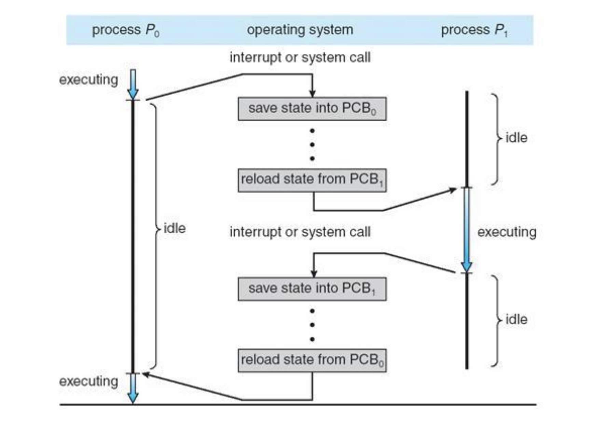

> # 프로세스와 스레드
>
> 1. [프로세스의 개요](https://goldggyul.github.io/os-001-process/)
> 2. [프로세스 제어 블록과 문맥 교환](https://goldggyul.github.io/os-002-pcb/)
> 3. [프로세스의 연산](https://goldggyul.github.io/os-003-process-struct/)
> 4. [스레드](https://goldggyul.github.io/os-004-thread/)
> 5. [[심화학습] 동적 할당 영역과 시스템 호출](https://goldggyul.github.io/os-005-system-call/)

# PCB: Process Control Block

## 📌 프로세스 제어 블록

[프로세스의 개요](https://goldggyul.github.io/os-001-process/)에서 프로세스를 실행하는 데 메모리만 필요한 것이 아니고, 관리하기 위한 자료 구조로 PCB가 필요하다고 했죠? PCB에 대해 더 알아봅시다.

- 프로세스를  Task라고도 하는 것처럼, PCB 역시 TCB라고도 부릅니다.

### ☘️ PCB 구성

<table style="text-align: center;">
  <tr>
    <td><strong>포인터</strong></td>
    <td>프로세스 상태</td>
  </tr>
  <tr>
    <td colspan="2">Process ID</td>
  </tr>
  <tr>
    <td colspan="2">Process Priority</td>
  </tr>
    <tr>
    <td colspan="2">Program Counter</td>
  </tr>
  <tr>
    <td colspan="2">각종 CPU Registers 정보</td>
  </tr>
  <tr>
    <td colspan="2">메모리 관리 정보</td>
  </tr>
  <tr>
    <td colspan="2">할당된 자원 정보</td>
  </tr>
  <tr>
    <td colspan="2">PPID와 CPID</td>
  </tr>

</table>

1. 포인터
   - [프로세스의 개요](https://goldggyul.github.io/os-001-process/)에서 프로세스의 상태에 따라 큐로 운영된다고 했습니다. 이 때 queue에서 PCB를 연결할 때 포인터를 사용합니다.
2. 프로세스 상태
   - Run, Ready, Waiting 등의 상태
3. 프로세스 ID
   - 프로세스를 구별하기 위한 구분자
4. 프로그램 우선순위
   - CPU Scheduling이 일어나서 스케줄러가 준비 상태에 있는 프로세스 중 실행 상태로 옮겨야 할 프로세스를 어떻게 선택할까요?
   - 프로세스 우선순위를 기준으로 삼아서, 높은 우선순위의 프로세스를 먼저 실행하게 됩니다. 이에 관한건 스케줄링만 다룰 때 더 자세히 살펴보겠습니다.
5. 프로그램 카운터
   - 다음에 실행될 명령어의 위치를 가리키는 프로그램 카운터 값을 저장해놓습니다. 이게 있어야 Context Switching이 일어나서 다시 프로세스가 실행될 때 어디를 실행해야할 지 알 수 있겠죠?
6. 각종 레지스터 정보
   - 프로세스가 실행되면서 함수를 호출할 때마다 지역 변수는 스택에 저장되죠? 그럼 이 스택이 어딨는 지를 알아야 저장을 할 수 있습니다. 이 때 `스택 포인터`도 이 레지스터 정보에 포함됩니다.
   - 이 값을 저장해놔야 다음에 실행할 때 이어서 실행할 수 있을 거에요.

7. 메모리 관리 정보
   - 할당받았던 메모리가 어디 있는지 나타내는 위치 정보, `segmentation table`, `page table`의 정보도 보관합니다. 더 자세한 건 가상 메모리에 대해 다룰 때 정리하겠습니다.
8. 할당된 자원 정보
   - 프로세스가 실행 중에 사용하는 파일, 입출력 장치 같은 리소스는 처음 사용될 때 OS가 리소스 번호를 할당합니다. 이 때 이 번호는 양의 정수로서, PCB의 file descriptor table에 등록됩니다. 
   - 참고: [bash-shell/file_descriptors](https://mug896.github.io/bash-shell/file_descriptors.html)
9. PPID와 CPID
   - 부모 프로세스를 가리키는 PPID, 자식 프로세스(들)를 가리키는 CPID 정보도 저장됩니다.
   
     >예를 들어 `fork()` 시스템 호출로 프로세스가 복사됩니다. 이 때 원래 실행하던 프로세스는 부모 프로세스, 새로 생긴 프로세스는 자식 프로세스로 부모-자식 관계가 됩니다.

## 📌 Context Switching

CPU가 한 프로세스가 끝날 때까지 다른 프로세스를 실행하지 않으면 비효율적이어서  여러 프로세스를 번갈아가면서 실행하고, 그 때 프로세스의 정보들을 PCB에 저장해서 관리한다고 했습니다. 그럼 <u>어떻게 번갈아가면서 실행할까요?</u>

### ☘️ Context Switching(문맥 교환)이란

Context Switching이란 CPU를 차지하던 프로세스가 나가고 새로운 프로세스를 받아들이는 작업입니다. 이 때 실행 상태에서 나가는 PCB에는 지금까지의 작업 내용을 저장하고, 반대로 실행 상태로 들어오는 PCB의 내용을 읽어서 레지스터에 적재하여 CPU가 세팅됩니다. 그래야 들어오는 프로세스가 계속해서 이어서 작업을 할 수 있겠죠?

즉, 이와 같이 두 프로세스의  PCB를 교환하는 작업이 Context Switching입니다. 그리고 이 때 교체되는 새로운 프로세스는 CPU 스케줄러에 의해 결정됩니다.

### ☘️ 언제 일어날까?

인터럽트가 발생했을 때 일어납니다.

- 일반적으로는 프로세스가 주어진 CPU 사용 허가 시간을 모두 소진할 때

- 입출력을 위해 대기할 때

- 자식 프로세스를 만들 때
- 인터럽트 처리를 기다릴 때

### ☘️ 절차

프로세스 P1과  P2의 Context switching 과정을 좀 더 살펴봅시다.



| 단계 | 절차                          | 설명                                                         |
| ---- | ----------------------------- | ------------------------------------------------------------ |
| 1    | 인터럽트/ 시스템 호출         | 어떤 이유로 인터럽트가 발생합니다. 예를 들어, 실행 상태에 있는 프로세스 P1이 주어진 시간을 다 사용하여 운영체제에서 스케줄러에 의해 인터럽트가 발생합니다. |
| 2    | 커널 모드 전환                | P1이 유저 모드에서 커널 모드로 전환, P1은 준비 상태          |
| 3    | 현재 프로세스 상태 PCB에 저장 | P1의 현재 프로세스 상태 PCB에 저장                           |
| 4    | 다음 실행 프로세스 로드       | P2의 PCB 정보를 통해 CPU 레지스터 정보를 채움<br /><br />이 때 Program Counter를 통해 어느 명령어를 실행할 지를 알 수 있고, Stack Pointer를 통해 프로세스의 스택 영역 마지막 주소를 알 수 있습니다. |
| 5    | 유저 모드 전환                | P2 프로세스 커널 모드에서 유저 모드로 전환되어 실행          |

### ☘️  단점

Context Switching이 너무 잦으면 오버헤드가 발생해서 성능이 떨어집니다.

- 커널 모드, 유저 모드 전환하면서 상태 저장하고 레지스터값 다시 불러오고..
- 그 외에도 캐시 메모리도 비워야 하고..
- 이러는 동안  CPU는 다른 작업을 하지 못합니다.

그럼에도 불구하고 CPU를 그냥 놀게 놔두는 것보다 다른 프로세스를 수행시키는 것이 더 효율적일 때 스케줄러는 Context Switching을 합니다.

> <span style="font-size:110%">
>
> 🙋 오버헤드를 해결할 수 있는 방법이 있을까요?
>
> 👮 스레드를 이용하여 줄일 수 있습니다.
>
> </span>
>
> 스레드는 Context Switching 시에 Stack 영역을 제외한 Text, Data, Heap 영역은 프로세스의 것으로 서로 공유하여 자신의 PCB(TCB)에는 간단한 정보만 저장합니다. 따라서 프로세스 Context Switching보다 빠릅니다.
>
> 또 프로세스 Context Switching은 더 빠르게 접근하기 위한 임시 저장소인 캐시 메모리 역시 초기화해야 합니다. 메모리에서 자주 접근하는 <u>데이터</u>를 저장한 곳이므로, 데이터 영역이 달라지면 캐시 메모리도 소용 없어지겠죠? 하지만 스레드는 Stack 영역 외에는 공유하므로 캐시 메모리를 비울 필요가 없어서 더 빠릅니다.

----

> 👀 다음을 참고하여 작성했습니다.
>
> - [쉽게 배우는 운영체제](http://www.yes24.com/Product/Goods/62054527)
> - 학부 수업
> - [@gyoogle/tech-interview-for-developer](https://github.com/gyoogle/tech-interview-for-developer/)


```toc
```

