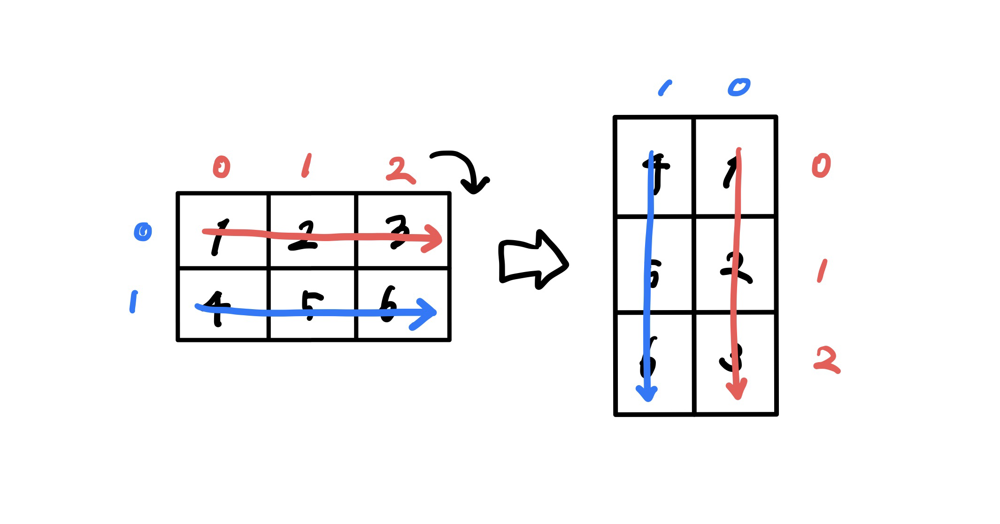

[백준 18808번 스티커 붙이기](https://www.acmicpc.net/problem/18808)를 풀다가 2차원 배열 회전을 해야 해서 찾아봤는데.. 다 `list(zip(*matrix[::-1]))`를 쓰는데 처음에 이해가 안가서 정리해봤습니다.


# 📌 좌표 이용 회전

우선 배열을 오른쪽으로 90도 회전할 때, 방향이 어떻게 바뀌는 지를 봅시다.



기존 배열에서 열은 행이 되고, 행은 뒤집은 순서로 열이 되는 걸 볼 수 있습니다.

따라서 기존 배열에서 인덱스가 `[i][j]`였다면, 회전한 배열에서 인덱스는 `[뒤집은 j][i]`가 됩니다. 즉, 기존 배열에서 열이 n개 있었다면, `[n-1-j][i]`가 됩니다.

따라서 회전시키는 함수는 아래와 같습니다.

```python
def rotate(matrix):
    n = len(matrix) # 기존 배열의 행 길이
    m = len(matrix[0]) # 기존 배열의 열 길이
    rotated = [[0] * n for _ in range(m))]
    for i in range(n):
        for j in range(m)):
            rotated[j][n-1-i] = matrix[i][j]
    return rotated
```

- 이 때 주의해야할 점은, 회전 배열을 채우기 위해 `[[0] * n for _ in range(m))]`로 채울 때, `[[0]*n]*m`을 하면 안된다는 점입니다. 이런 식으로 만든 리스트는 한 리스트를 레퍼런스하고 있어서, 한 리스트의 내용이 바뀌면 다 같이 바뀌게 된다고 합니다.

  ```python
  >>> li = [[0]*3]*2
  >>> li
  [[0, 0, 0], [0, 0, 0]]
  >>> li[0][1] = 1
  >>> li
  [[0, 1, 0], [0, 1, 0]] # 레퍼런스 하고 있어서 [1][1]도 같이 바뀌어버림
  ```

	> ### [Python docs](https://docs.python.org/3/library/stdtypes.html#sequence-types-list-tuple-range)
	> 
  > ```python
  > >>> lists = [[]] * 3
  > >>> lists
  > [[], [], []]
  > >>> lists[0].append(3)
  > >>> lists
  > [[3], [3], [3]]
  > ```
  >
  > What has happened is that `[[]]` is a one-element list containing an empty list, so all three elements of `[[]] * 3` are references to this single empty list. Modifying any of the elements of `lists` modifies this single list. You can create a list of different lists this way:
  >
  > ```python
  > >>> lists = [[] for i in range(3)]
  > >>> lists[0].append(3)
  > >>> lists[1].append(5)
  > >>> lists[2].append(7)
  > >>> lists
  > [[3], [5], [7]]
  > ```

# 📌 `list(zip(*matrix[::-1]))`

배열을 회전하는 또 다른 방법이 있습니다.

위 방법에서 봤던 것처럼, <u>**열은 행**</u>이 되고, <u>**행을 뒤집은 것이 열이 된다**</u>는 것을 볼 수 있습니다.

그럼 우선 행을 뒤집어볼까요?

```python
>>> matrix  = [[1,2,3],[4,5,6]]
>>> matrix
[[1, 2, 3], [4, 5, 6]]
>>> matrix[::-1]
[[4, 5, 6], [1, 2, 3]]
```

이 상태에서 세우면 됩니다. 그렇다는 건, 원래 행으로 나눠져 있던 애들이 새로운 행을 이루면 됩니다.

## `zip()`

파이썬의 `zip()`함수에 iterable한 객체를 넣으면, 각 객체를 튜플로 접근할 수 있는 iterator를 반환해줍니다.

- (가장 짧은 인자를 기준으로 데이터가 엮이고 나머지는 버려지기 때문에 길이가 다른 객체를 넣을 때는 주의해야 합니다.)

```python
>>> numbers = [1,2,3]
>>> letters = ['A','B','C']
>>> for pair in zip(numbers, letters):
...     print(pair)
...
(1, 'A')
(2, 'B')
(3, 'C')
>>> li = list(zip(numbers, letters))
>>> li
[(1, 'A'), (2, 'B'), (3, 'C')]
```

그럼 위에 배열에서 <u>**각 행을 따로 따로 넘겨주면, 각 행의 열 순서대로 묶어서 새로 행을 이룬 iterator**</u>를 얻을 수 있겠죠?

## packing, unpacking (*args)

`*` 을 이용하면 packing, unpacking을 할 수 있습니다.

```python
>>> print(li)
[(1, 'A'), (2, 'B'), (3, 'C')]
>>> print(*li) # unpacking
(1, 'A') (2, 'B') (3, 'C')
>>> def print_packed(*li): # packing 해서 받기
...     print(li) # packing된 결과
...     print(*li) # unpacking해서 print 
...
>>> print_packed('a', 'b', 'c')
# print(('a','b','c'))와 같은 결과
('a', 'b', 'c') # 'a', 'b', 'c'가 하나의 튜플로 packing됨
# print('a','b','c')와 같은 결과
a b c # 튜플이 unpacking되어서, print('a', 'b', 'c')
```

이를 이용해서, 2차원 배열을 unpacking하고,  zip을 이용하면 열끼리 묶어서 새로운 행이 된 배열을 얻을 수 있습니다.

```python
>>> matrix
[[1, 2, 3], [4, 5, 6]]
>>> list(zip(*matrix[::-1]))
[(4, 1), (5, 2), (6, 3)]
```

`zip()`은 각 iterable 객체에서 인자들을 튜플로 묶어서  zip object로 반환하므로 `list()`를 이용해서 데이터 타입을 바꿔줍니다.

여기서 주의할 것은 튜플로 묶어서 반환하므로 2차원 배열 안이 리스트가 아닌 튜플임에 주의해야 합니다. list는 mutable하지만 튜플은 immutable합니다.

따라서 리스트로 얻고 싶다면 아래와 같이 해야합니다.

```python
>>> matrix
[[1, 2, 3], [4, 5, 6]]
>>> [[row[j] for row in matrix[::-1]] for j in range(len(matrix[0]))]
[[4, 1], [5, 2], [6, 3]]
```

열마다 묶어야 하므로, 열마다 반복을 합니다. 근데 묶을 때는 행에서 각 열번호의 값을 묶어야 하므로,

기존 배열의 행을 아래서부터 반복하면서 각 행의 해당 열번호(j)의 값을 받아오고 list로 묶습니다.

# 📌 전치

행 ↔️ 열을 바꾸면 되므로, 행인 애들끼리 다시 열로 묶으면 됩니다. 그러므로 그냥 unpacking 후 zip()을 해주면 됩니다.

```python
>>> list(zip(*matrix))
[(1, 4), (2, 5), (3, 6)]
```

----

# 📌 etc

## unpacking(*) 이용해서 2차원 배열 예쁘게 출력하기

그냥 배열을 출력하면 다음과 같이 나옵니다.

```python
>>> matrix
[[1, 2, 3], [4, 5, 6]]
```

하지만 행마다 줄바꿈을 해서 출력하고 싶다면? 라이브러리 등등 다른 방법도 있지만 그냥 간단하게 출력하려면 아래와 같이 하면 됩니다.

```python
>>> print(*matrix, sep='\n')
[1, 2, 3]
[4, 5, 6]
```

unpacking해서 각 리스트를 넘기고, <u>**sep 옵션을 통해 기본 띄어쓰기 대신 엔터를 구분자**</u>로 넣으면 됩니다.


```toc
```

