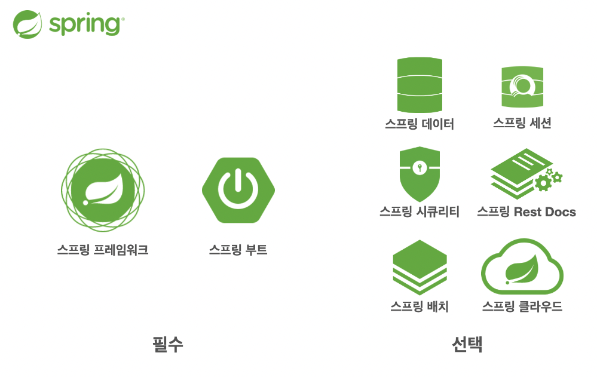
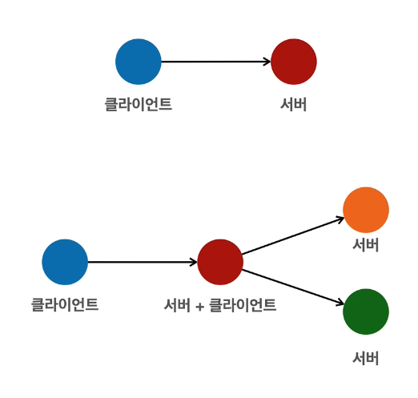
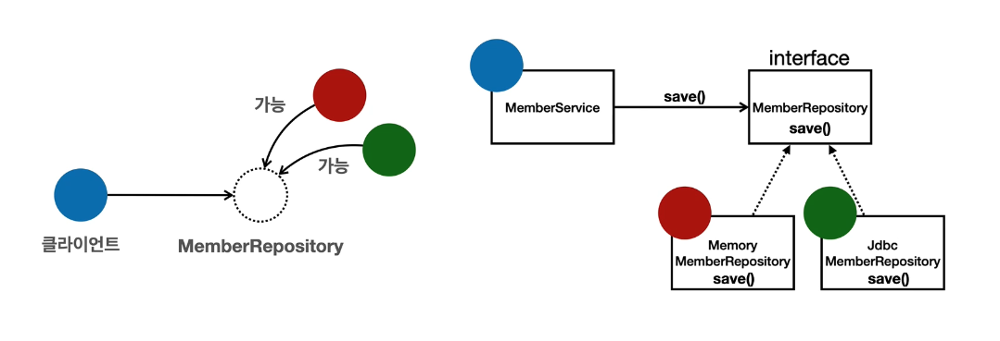
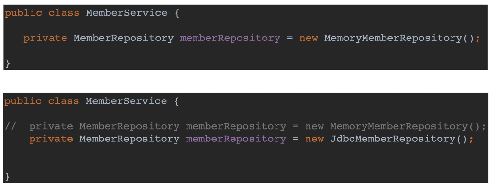

> 본 게시글은 [스프링 핵심 원리 - 기본편](https://www.inflearn.com/course/%EC%8A%A4%ED%94%84%EB%A7%81-%ED%95%B5%EC%8B%AC-%EC%9B%90%EB%A6%AC-%EA%B8%B0%EB%B3%B8%ED%8E%B8) 강의를 듣고 정리했습니다.

#  ☘️ 객체 지향 설계와 스프링

스프링을 제대로 학습하려면 스프링이 제공하는 기능만 아는 게 아니라 객체지향의 원리와, 그 원리를 스프링이 어떻게 지원하는 지 함께 풀어가면서 이해해야 한다! 이 과정을 이해하고 나면 개발, 설계하는 시야가 달라지고 정말 재밌어진다.

단순히 스프링 기능을 배우는 건 어렵지 않고, 스프링이 제공하는 핵심 가치와 원리를 제대로 파악하려면 객체 지향을 이해해야 한다. 스프링의 본질을 이해했다는 것은 객체 지향 설계의 본질을 이해하는 것과 같다.

## 📌 자바 진영의 추운 겨울과 스프링의 탄생

당시 쓰던 EJB(Enterprise Java Bean)...

하지만 여기서 불편함을 느끼고 `스프링`과 `하이버네이트` 두 기술이 개발되었다.

스프링은 EJB 컨테이너, 하이버네이트는 EJB 엔티티빈 기술을 대체하게 되었다. 그리고 하이버네이트를 바탕으로 자바 ORM 표준으로 JPA가 나오게 되었다.

EJB의 문제점을 지적하고, EJB 없이도 훌륭한 확장 가능한 애플리케이션이 개발할 수 있음을 코드로 보여주던 로드 존슨의 책에서 시작해서 스프링이 개발되게 되었다.

스프링은 정말 좋지만 세팅이 힘들고, 스프링을 갖고 웹 애플리케이션을 개발하면, 톰캣이라는 웹서버에 앱을 war로 빌드해서 넣고 배포해야 하는데 이것도 복잡하다. 스프링부트에서는 당시 웹서버를 내장해서 편하게 띄우는 것이 유행하고 있어서 그를 받아들이고 설정도 거의 할 게 없도록 발전했다. 

## 📌 스프링이란?

### 스프링 생태계



- 스프링 프레임워크
  - 핵심 기술: 스프링 DI 컨테이너, AOP, 이벤트 등등
  - 최근엔 스프링 부트를 통해 스프링 프레임워크의 기술들을 편리하게 사용
- 스프링 부트
  - 스프링을 편리하게 사용할 수 있도록 지원, 최근에는 기본으로 사용
  - 톰캣 같은 웹 서버를 내장해서 별도의 웹 서버를 설치하지 않고도 단독으로 실행할 수 있는 스프링 애플리케이션을 쉽게 생성
  - 필요한 라이브러리들을 다 가져오지 않아도 starter를 통해 필요한 나머지 라이브러리들도 다 받아올 수 있음
  - 외부 라이브러리 버전도 알아서 테스트해놓으므로 그냥 가져오면 됨

### 스프링 핵심 개념

핵심 컨셉을 이해해야 한다!

스프링은 객체 지향 언어가 가진 강력한 특징을 살려내는 프레임워크다. 따라서 스프링은 <u>**좋은 객체 지향 애플리케이션을 개발할 수 있게 도와주는 프레임워크**</u>다. 그렇다면 좋은 객체 지향 프로그래밍이란 뭔가?

## 📌 좋은 객체 지향 프로그래밍이란? ✨

### 객체 지향 프로그래밍

- 객체 지향 프로그래밍은 컴퓨터 프로그램을 명령어의 목록으로 보는 시각에서 벗어나 여러 개의 독립된 단위, 즉 `"객체"`들의 `모임`으로 파악하고자 하는 것이다. 각각의 `객체`는 `메시지` 를 주고받고, 데이터를 처리할 수 있다. (`협력`) 
- 객체 지향 프로그래밍은 프로그램을 `유연`하고 `변경`이 용이하게 만들기 때문에 대규모 소프트웨어 개발에 많이 사용된다.
  - 레고 블럭을 조립하듯이 컴포넌트를 쉽고 유연하게 변경하면서 개발할 수 있다는 것
  - 바로 객체 지향의 핵심 `다형성`!

### 다형성

> <u>**다형성이란 간단하게 말하면 하나의 타입에 여러 객체를 대입할 수 있는 성질**</u>이다.
>
> 따라서 이 성질을 이용하면, 확장하거나 변경을 할 때 타입 변경 없이 쉽게할 수 있다.

구현이 바뀌어도 역할만 같다면 해당 객체를 사용하는 데 문제가 없다!

- 새로운 자동차가 나온다고 운전자를 바꿀 필요가 없다. 운전자는 그냥 운전할 수 있다.

역할이라는 인터페이스를 따라서 구현을 해놨고, 사용자는 인터페이스에 대해서만 의존하면서 사용한다.

다른 대상으로 변환이 가능하고, 심지어 완전 새로운 것이 나와도 기존 역할을 따르기만 한다면 사용할 수 있다. 세상을 바꾸지 않고 무한히 확장이 가능한 것.

- 역할과 구현으로 세상을 구분했기 때문에 가능하다. 


### 역할과 구현을 분리

역할과 구현을 구분하면 세상이 단순해지고, 유연해지며 변경도 편리해진다.

- 클라이언트는 대상의 역할(인터페이스)만 알면 된다.
- 구현 대상의 내부 구조가 변경 되든 구현 대상이 바뀌든 클라이언트는 영향을 받지 않는다.

프로그래밍 언어에서도 이런 개념을 차용한 것이다. 자바 언어의 측면에서 말하자면

- 자바 언어의 다형성을 활용해서 해결
  - 역할 == 인터페이스
  - 구현 == 인터페이스를 구현한 클래스, 구현 객체
- 객체를 설계할 때 역할과 구현을 명확히 분리한다.
  - 객체 설계 시 역할(인터페이스)을 먼저 부여하고, 그 역할을 수행하는 구현 객체 만들기
  - (물론 인터페이스가 아니라 그냥 일반 상속관계도 다형성이 가능하지만 인터페이스가 낫겠죠?)
- 그니까 핵심은 구현보다 역할이 더 중요하다는 것

### 객체는 협력이라는 관계부터 생각

혼자 있는 객체는 없다. 생각해보면, 다형성을 공부하면서 뭐 클래스가 있고 부모를 상속받아 어쩌구... 하지만 이 관계에서 <u>**클라이언트**</u>가 없다. 중요한 건 클라이언트다.

클라이언트가 요청을 하고, 서버가 응답한다. 수 많은 객체 클라이언트와 객체 서버는 서로 협력 관계를 가진다.



### 자바 언어의 다형성 - `오버라이딩`!



- 오버라이딩된 메서드가 실행된다.
- <u>**다형성의 본질**</u>: 다형성으로 <u>**인터페이스를 구현한 객체를 실행 시점에 유연하게 변경**</u>할 수 있다.
  - 다형성의 본질을 이해하려 협력에서 시작해야 한다.
  - 클라이언트를 변경하지 않고, 서버의 구현 기능을 유연하게 변경할 수 있다.

- 한계

  - 대신 역할(인터페이스) 자체가 변하면 다 변경해야 한다!

    인터페이스를 안정적으로 변화가 없도록 잘 설계하는 것이 중요하다. 자바에서만 국한된 게 아니고, API 서버와 클라이언트 사이 인터페이스의 설계도 마찬가지다.

### 스프링과 객체 지향

객체 지향의 꽃은 다형성이다. 스프링은 다형성을 극대화해서 이용할 수 있게 도와준다. 

스프링에서 이야기하는 `제어의 역전(IoC)`, `의존관계 주입(DI)`은 다형성을 활용해서 역할과 구현을 편리하게 다룰 수 있도록 지원한다. 

## 📌 SOLID: 좋은 객체 지향 설계의 5가지 원칙

사실 다형성 외에 SOLID라는 객체 지향 설계 원칙 역시 알아야 더 제대로 설명할 수가 있다.

### 1. `SRP`: 단일 책임 원칙(single responsibility principle)

사실 하나의 책임이라는 건 모호하다.

그래서 중요한 기준으로 `변경`을 생각해볼 수 있다. 변경이 있을 때 파급 효과가 적으면 단일 책임 원칙을 잘 따른 것

 ### 2. ✨`OCP`: 개방-폐쇄 원칙 (Open/closed principle)

소프트웨어 요소는 확장에는 열려 있으나 변경에는 닫혀 있어야 한다 

- 이게 어떻게 말이 돼? 확장을 하려면, 당연히 기존 코드를 변경해야 되지 않나?
  - 다형성을 활용하면 된다! 인터페이스를 구현한 새로운 클래스를 하나 만들어서 새로운 기능을 구현하면 구현체를 바꾸면 된다.

<u>**문제점**</u> ✨✨



- 구현체를 집어 넣는 코드는 변경해야 한다. 다형성을 사용했지만 OCP 원칙이 깨져버리는 것...
- 따라서 <u>**객체를 생성하고, 연관관계를 맺어주는 별도의 조립, 설정자가 필요하다!!**</u> -> 스프링 컨테이너!

### 3. `LSP`: 리스코프 치환 원칙 (Liskov substitution principle)

다형성에서 하위 클래스는 인터페이스 규약을 다 지켜야 한다. 단순히 컴파일이 되냐 안되냐의 문제가 아니고, 역할을 제대로 해야 한다.

- 예) 자동차 인터페이스의 엑셀은 앞으로 가라는 기능, 뒤로 가게 구현하면 LSP 위반, 느리 더라도 앞으로 가야함

### 4. `ISP`: 인터페이스 분리 원칙 (Interface segregation principle) 

특정 클라이언트를 위한 인터페이스 여러 개가 범용 인터페이스 하나보다 낫다.

인터페이스가 변경되도 최대한 영향을 덜 줄 수 있다.

- 자동차 인터페이스 ➡️ 운전 인터페이스, 정비 인터페이스로 분리
- 사용자 클라이언트 ➡️ 운전자 클라이언트, 정비사 클라이언트로 분리
- 분리하면 정비 인터페이스 자체가 변해도 운전자 클라이언트에 영향을 주지 않음. 정비사 클라이언트만 바꾸면 된다.
- 인터페이스가 명확해지고, 대체 가능성이 높아진다 

### 5. ✨`DIP`: 의존관계 역전 원칙 (Dependency inversion principle)

구현 클래스에 의존하지 말고, 인터페이스에 의존해라. ➡️ 역할에 의존해라!

- 그래야 언제든지 구현체를 갈아끼울 수 있겠죠?

<u>**문제점**</u> ✨✨

위에 [`OCP` 원칙](#2-code-classlanguage-textocpcode-개방-폐쇄-원칙-openclosed-principle)에서 봤던 코드를 다시 봐보자.


- MemberService가 MemberRepository(인터페이스)라는 필드에 MemomryMemberRepository(구현체)를 할당하면서, 결국 MemomryMemberRepository를 의존하게 된다.
  - 의존한다 = 코드를 안다
  - 즉, MemberService는 인터페이스에 의존하지만, 구현 클래스도 동시에 의존한다

- MemberService가 구현체를 알고, 직접 선택(의존)하고 있기 때문에 변경하려면 코드를 바꿔야 한다.
  - <u>**DIP 위반!**</u>

### 정리

분명 객체 지향의 핵심은 <u>**다형성**</u>이라고 했다. 근데 위 문제점들을 보면 OCP와 DIP를 위반한 것을 볼 수 있다. 다형성만으로는 쉽게 부품을 갈아 끼우듯이 개발할 수 없다. (클라이언트의 코드도 바꿔야 하기 때문)

그럼 어떡해???? 뭔가 더 필요하다!

## 📌 객체 지향 설계와 스프링

스프링 이야기에 왜 객체 지향 이야기가 나오는가?

사실 스프링은 다음 기술을 통해 <u>**다형성 + OCP, DIP**</u>가 가능하게 지원해주는 기술이다.

- DI 컨테이너 제공 (DI(Dependency Injection): 의존관계, 의존성 주입): 자바 객체들을 컨테이너에 넣어 놓고 이 안에서 의존 관계를 연결하고 주입해준다.

이 도움 덕에 클라이언트의 코드 변경 없이 쉽게 부품을 교체하듯이 기능을 확장할 수 있다.

### 스프링이 없으면..?

순수하게 자바로 OCP, DIP 원칙들을 지키면서 개발을 해보면, 결국 스프링 프레임워크를 만들게 된다. (더 정확히는 DI 컨테이너) 

- DI 개념은 말로 설명해도 이해가 잘 안된다. 코드로 짜봐야 필요성을 알게된다! 그러면 앞으로 스프링이 왜? 만들어졌는지 코드로 이해해보자

### 정리

모든 설계에 역할과 구현을 분리하자.

- 이상적으로 '모든' 설계지만.. 하지만 인터페이스를 무분별하게 남발하면 추상화라는 비용이 발생한다. -> 구현 클래스를 만드는 문제는 둘째치고, 개발자가 코드를 한 번 더 열어봐야 한다. 구현 클래스가 뭔지 안보이니까 더 살펴봐야 하는 것.
- 그래서 추천하는 건.. 기능을 확장할 가능성이 없다면, 구체 클래스를 직접 사용하고, 향후 꼭 필요할 때 리팩터 링해서 인터페이스를 도입하는 것도 방법이다.
- 근데 딱 보고 확장 가능성이 있다면 도입하는 것이 좋다. 이런 미묘한 차이를 잘 설계하는 것이 좋은 설계..

애플리케이션 설계도 공연을 설계 하듯이 배역만 만들어두고, 배우는 언제든지 유연하게 변경할 수 있도록 만드는 것이 좋은 객체 지향 설계다.


```toc
```

