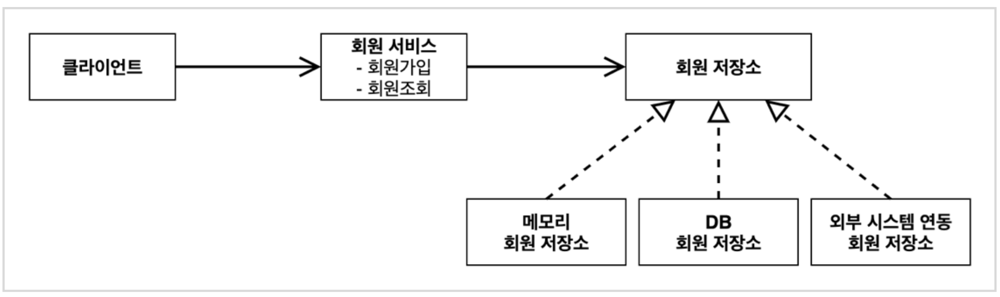
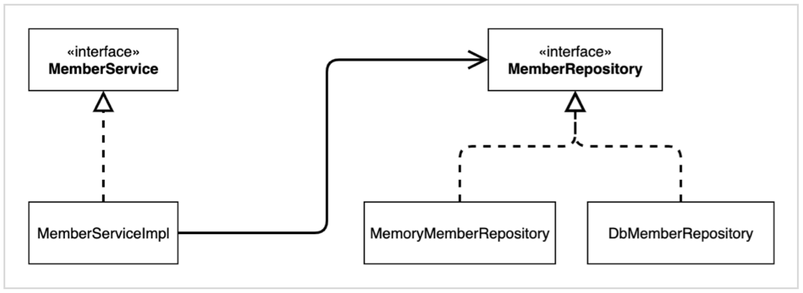
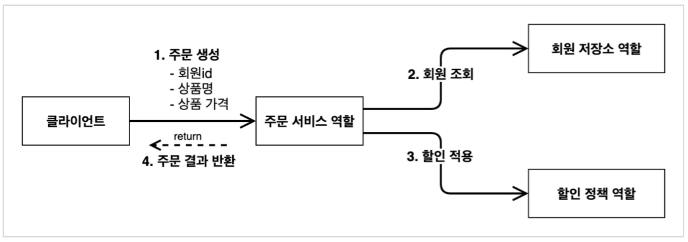
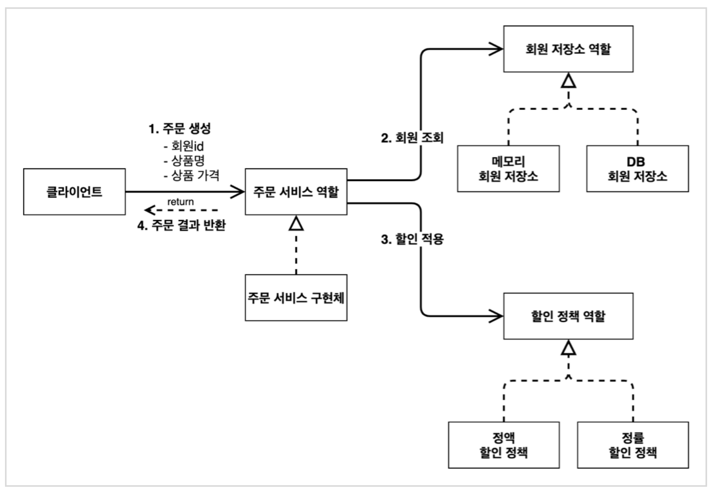
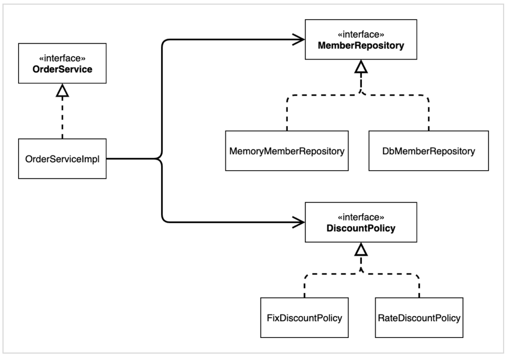
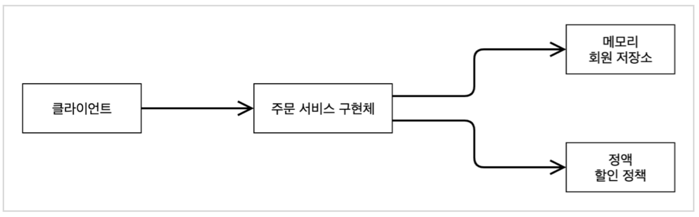

> 본 게시글은 [스프링 핵심 원리 - 기본편](https://www.inflearn.com/course/%EC%8A%A4%ED%94%84%EB%A7%81-%ED%95%B5%EC%8B%AC-%EC%9B%90%EB%A6%AC-%EA%B8%B0%EB%B3%B8%ED%8E%B8) 강의를 듣고 정리했습니다.

#  ☘️ 스프링 핵심 원리 이해1 - 예제 만들기

그럼 인터페이스(역할)와 구현하는 객체를 나누어서 개발을 해보자

## 📌 프로젝트 생성

순수 자바로만 할거라 스프링을 쓰진 않지만 세팅할 때 스프링부트를 이용하면 편해서 일단 스프링부트로 생성하자 -> [스프링 부트 스타터](https://start.spring.io)

- 스프링 부트 버전에서 snapshot, m5 이런 건 안정화가 아직 안된 것이니 가장 최신 안정화가 된 걸 선택하자. (현재 시점 2.7.4)
- artifact가 프로젝트 빌드명이 된다.

- 자바 11
- dependency는 선택하지 않는다.

생성 후 인텔리제이에서 열어주자. 이 때 Preference>Build>Build Tools>Gradle에서 Build and run, Run tests를 gradle이 아닌 intellij를 사용하도록 변경하자. 이게 좀 더 빠르다.

## 📌 비즈니스 요구사항

> ### 역할과 구현 구분하기!

우선 요구사항은 3가지로 `회원`, `주문`, `할인 정책`이 있다.

### 회원

- 회원을 가입하고 조회할 수 있다.
- 회원은 일반과 VIP 두 가지 등급이 있다.
- 회원 데이터는 자체 DB를 구축할 수 있고, 외부 시스템과 연동할 수 있다. (미확정)

### 주문과 할인 정책

- 회원은 상품을 주문할 수 있다.
- 회원 등급에 따라 할인 정책을 적용할 수 있다.
- 할인 정책은 모든 VIP는 1000원을 할인해주는 고정 금액 할인을 적용해달라. (나중에 변경 될 수 있다.)
- 할인 정책은 변경 가능성이 높다. 회사의 기본 할인 정책을 아직 정하지 못했고, 오픈 직전까지 고민을 미루고 싶다. 최악의 경우 할인을 적용하지 않을 수 도 있다. (미확정)

요구 사항을 정리해보면 회원 데이터나, 할인 정책은 아직 결정되지 않았다. 하지만 앞에서 배운 객체 지향 설계 방법대로 인터페이스를 만들고 구현체를 언제든지 갈아끼울 수 있도록 설계하면 된다!

## 📌 회원 도메인 설계

회원 데이터가 아직 미확정이므로, 회원 저장소 인터페이스를 만들고 구현체를 만들자.

### 회원 도메인 협력 관계



### 회원 클래스 다이어그램



### 회원 객체 다이어그램

객체 간 참조를 나타낸다.


- 회원 서비스: `MemberServiceImpl`

목적? 실제로 서버가 실행 되고 런타임에 MemberRepository에 어떤 구현체가 들어갈 지는 클래스 다이어그램만으로는 알 수 없다. 런타임에 동적으로 결정된다. 따라서 판단하기 어려우므로, 객체 다이어그램에서 실제 사용하는 관계를 나타낸다. 실제로 new 한 객체들끼리의 참조를 볼 수 있다.

클래스 다이어그램은 정적, 객체 다이어그램은 동적인 관계를 나타낸다.

## 📌 회원 도메인 개발

- 단축키
  - `Command + Option + V`: 왼쪽 선언부 채우기
  - `Command + Shift + Enter`: 한 줄 마무리
  
- Grade

  ```java
  public enum Grade {
      BASIC,
      VIP
  }
  ```

- Member
  ```java
  public class Member {
      private Long id;
      private String name;
      private Grade grade;
  
      // 생성자와 Getter Setter
  }
  ```
  
- MemberRepository(Interface)
  ```java
  public interface MemberRepository {
      void save(Member member);
      Member findById(Long memberId);
  }
  ```
  
- MemoryMemberRepository(구현체)
  ```java
  public class MemoryMemberRepository implements MemberRepository {
  
      private static Map<Long, Member> store = new HashMap<>();
  
      @Override
      public void save(Member member) {
          store.put(member.getId(), member);
      }
  
      @Override
      public Member findById(Long memberId) {
          return store.get(memberId);
      }
  }
  ```
  
- MemberService(Interface)
  ```java
  public interface MemberService {
      void join(Member member);
      Member findMember(Long memberId);
  }
  ```
  
- MemberServiceImple(구현체)
  
  - 인터페이스에 대한 구현체가 하나만 있으면 `인터페이스명+Impl`을 많이 사용한다. 
  
  ```java
  public class MemberServiceImpl implements MemberService {
  
      private final MemberRepository memberRepository = new MemoryMemberRepository();
  
      @Override
      public void join(Member member) {
          // 다형성에 의해 구현체의 save 메서드 호출됨
          memberRepository.save(member);
      }
  
      @Override
      public Member findMember(Long memberId) {
          return memberRepository.findById(memberId);
      }
  }
  ```


## 📌 회원 도메인 실행과 테스트

### main에서 테스트

- 단축키
  - `soutv`: 위에 변수 중 선택해서 출력

```java
public class MemberApp {
    public static void main(String[] args) {
        MemberService memberService = new MemberServiceImpl();
        Member member = new Member(1L, "memberA", Grade.VIP);
        memberService.join(member);

        Member findMember = memberService.findMember(1L);
        System.out.println("new member = " + member.getName());
        System.out.println("find Member = " + findMember.getName());
    }
}
```

매번 main에서 출력해서 눈으로 확인하는 것은 어렵다.

### 테스트 함수 작성

- 테스트 문법
  - given: ~~한 환경에서
  - when: ~~게 주어졌을 때
  - then: ~~게 된다 
- 눈으로 결과를 보면서 테스트가 잘 됐는지 확인할 필요가 없다.

```java
class MemberServiceTest {

    MemberService memberService = new MemberServiceImpl();

    @Test
    void join() {
        // given
        Member member = new Member(1L, "memberA", Grade.VIP);
        // when
        memberService.join(member);
        Member findMember = memberService.findMember(1L);
        // then
        Assertions.assertThat(member).isEqualTo(findMember);
    }
}
```

----

### 문제점

- OCP 원칙을 지키는가?

  - 구현체가 바뀌면 MemberService의 코드를 수정해야 한다.

- DIP 원칙을 지키는가?

  - MemberService가 인터페이스인 MemberRepository를 의존하고 있긴 하지만 구현체인 MemoryMemberRepository까지 의존하고 있다.

    ➡️ 추상화, 구체화 둘다 의존하고 있다.

## 📌 주문과 할인 도메인 설계

- 상품은 Item같은 객체를 따로 만드는 게 아니고 예제를 간단하게 만들기 위해 상품명으로 구분하도록 한다.

### <u>협력, 역할, 책임</u>



1. 주문 생성: 클라이언트는 주문 서비스에 주문 생성을 요청한다.
2. 회원 조회: 할인을 위해서는 회원 등급이 필요하다. 그래서 주문 서비스는 회원 저장소에서 회원을 조회한다.
3. 할인 적용: 주문 서비스는 회원 등급에 따른 할인 여부를 할인 정책에 위임한다.
4. 주문 결과 반환: 주문 서비스는 할인 결과를 포함한 주문 결과를 반환한다

### 역할 + 구현



<u>**역할과 구현을 분리**</u>해서 자유롭게 구현 객체를 조립할 수 있게 설계했다. 덕분에 회원 저장소는 물론이고, 할인 정책도 유연하게 변경할 수 있다.

- 예를 들어 지금은 1000원으로 정액 할인이라고 해도, 정률 할인으로 10%할인 등 다른 할인 정책을 만들어 유연하게 변경할 수 있다.

### 클래스 다이어그램



### 객체 다이어그램



- 혹시 구현체가 바뀌더라도 <u>**역할들의 협력 관계를 그대로 재사용**</u>할 수 있다.

## 📌 주문과 할인 도메인 개발

- 단축키
  - `f2`: 오류 있는 곳으로 이동 (패키지 임포트 못했을 때 f2 누르고 옵션 엔터 하는 식으로 이용)
  
- DiscountPolicy(Interface): 할인 정책

  - 멤버를 인자로 받고 등급에 따라서 할인되는 금액을 리턴

  ```java
  public interface DiscountPolicy {
      /**
       * @return 할인 대상 금액
       */
      int discount(Member member, int price);
  }
  ```

- FixDiscountPolicy(구현체)

  ```java
  public class FixDiscountPolicy implements DiscountPolicy {
  
      private int discountFixAmount = 1000; // 1000원 정액 할인
  
      @Override
      public int discount(Member member, int price) {
          // enum은 ==으로 비교
          // 등급만 받아도 됐지만 확장성 등을 고려 .. 이건 상황에 따라 고민해봐야함
          if (member.getGrade() == Grade.VIP) {
              return discountFixAmount;
          } else {
              return 0;
          }
      }
  }
  ```

- Order

  ```java
  public class Order {
      private Long memberId;
      private String itemName;
      private int itemPrice;
      private int discountPrice;
    
    	// 생성자, Getter, Setter, toString
    
      // 계산
      public int calculatePrice() {
          return itemPrice - discountPrice;
      }
  }
  ```

- OrderService(인터페이스)

  ```java
  public interface OrderService {
      // 주문 생성 메세지 -> 주문 결과 반환
      Order createOrder(Long memberId, String itemName, int itemPrice);
  }
  ```

- OrderServiceImple(구현체)

  - 주문 서비스는 정말 <u>**주문만**</u>해서 넘긴다. 이렇게 함으로써 할인 정책에 변화가 생겨도 주문 서비스는 영향을 받지 않는다.
  - SRP 원칙이 잘 지켜졌다.

  ```java
  public class OrderServiceImpl implements OrderService {
  
      private final MemberRepository memberRepository = new MemoryMemberRepository();
      private final DiscountPolicy discountPolicy = new FixDiscountPolicy();
  
      @Override
      public Order createOrder(Long memberId, String itemName, int itemPrice) {
          Member member = memberRepository.findById(memberId);
          // 할인은 모르겠고 네가 알아서 해줘~ 난 정말 주문만. -> SRP good
          int discountPrice = discountPolicy.discount(member, itemPrice);
          return new Order(memberId, itemName, itemPrice, discountPrice);
      }
  }
  ```

  

## 📌 주문과 할인 도메인 실행과 테스트

단위 테스트를 잘 만드는 것이 굉장히 중요하다.

```java
public class OrderServiceTest {
    MemberService memberService = new MemberServiceImpl();
    OrderService orderService = new OrderServiceImpl();

    @Test
    void createOrder(){
        Long memberId = 1L;
        Member member = new Member(memberId, "memberA", Grade.VIP);
        memberService.join(member);

        // VIP 인 경우 1000원 할인이 됐는가
        Order order = orderService.createOrder(memberId, "itemA", 10000);
        Assertions.assertThat(order.getDiscountPrice()).isEqualTo(1000);
    }
}
```

-------

## 🍄 정리

역할과 구현을 잘 분리해서 만들자.


```toc
```
