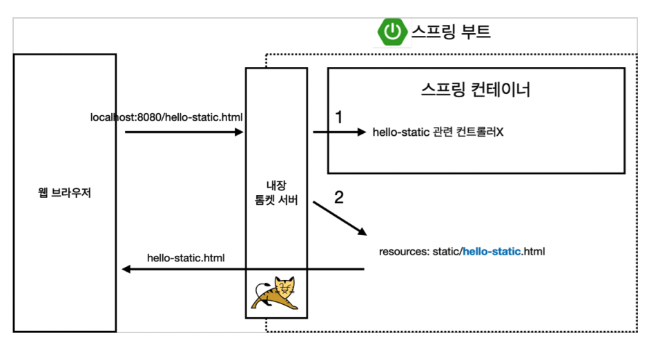
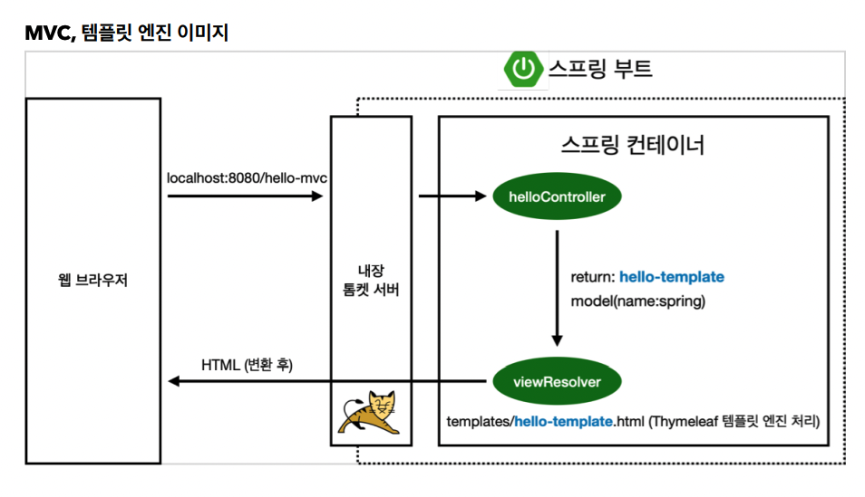
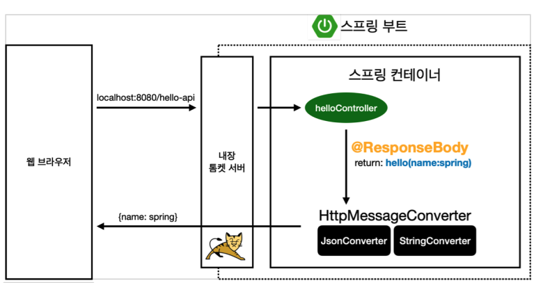

> 본 게시글은 [스프링 입문 - 코드로 배우는 스프링 부트, 웹 MVC, DB 접근 기술](https://www.inflearn.com/course/%EC%8A%A4%ED%94%84%EB%A7%81-%EC%9E%85%EB%AC%B8-%EC%8A%A4%ED%94%84%EB%A7%81%EB%B6%80%ED%8A%B8/) 강의를 듣고 필기용으로 정리했습니다.

# ☘️ 스프링 웹 개발 기초

웹을 개발한다는 건 <u>**크게 세 가지 경우**</u>가 있다.

1. 정적 컨텐츠: 서버에서 뭐 하는 거 없이 그냥 파일 그대로 내보낸다.
2. MVC와 템플릿 엔진: JSP같은 소위 템플릿 엔진. html을 동적으로 바꿔서 내보냄. 요즘은 이 패턴
3. API
   - json 데이터 포맷으로 클라(안드, ios 등등)한테 데이터 넘겨주기.
   - 서버끼리 통신

## 📌 정적 컨텐츠

### 스프링 부트 정적 컨텐츠 기능

- 스프링 부트는 정적 컨텐츠 기능을 기본적으로 제공한다. `/static`에서 static content를 찾는다.
- `url/파일명`을 하면 기본적으로 정적 파일을 찾아서 그대로 반환해준다.



- 큰 개념을 설명하자면 대략 이렇다. 자세한 건 다음 강의에서..
- 우선 요청이 들어오면, 내장 톰캣 서버가 요청을 받고 넘긴다.
- 그럼 스프링은 <u>**해당 이름의 컨트롤러를 먼저 찾는다**</u>. -> <mark>컨트롤러 우선순위가 더 높다</mark>는 뜻
- 컨트롤러가 없으므로, `resources`에 `static`폴더에서 해당 이름의 파일을 찾고, 그대로 리턴해준다.

## 📌 MVC와 템플릿 엔진

- 과거엔 Controller와 View가 분리되어 있지 않았고, View에서 다 했었다. (JSP)
  - 이 방식을 모델원 방식이라고 한다.

- 지금은 MVC 스타일로 한다.
  - for <u>**관심사 분리!**</u>
  - 비즈니스 로직과 화면 그리기 등등을 나누자.
  - 요즘은 V와 C를 쪼개는 게 기본.
  - View는 화면 관련 일만, 비즈니스 로직 등 서버 뒷단 관련된 건 Controller나 뒷단 비즈니스 로직에서 다 처리
  - 화면 쪽에 필요한 건 Model에 담아서 넘겨주기

- 예시로 컨트롤러 추가해보자.

  - Controller

    ```java
    @Controller
    public class HelloController {
        @GetMapping("hello-mvc")
        public String helloMvc(@RequestParam("name") String name, Model model){
            model.addAttribute("name", name);
            return "hello-template";
        }
    }
    ```

  - View: `resources/template/hello-template.html`

    ```html
    <!DOCTYPE HTML>
    <html xmlns:th="http://www.thymeleaf.org">
    <body>
    <p th:text="'hello ' + ${name}">hello! empty</p>
    </body>
    </html>
    ```

    - 타임리프 템플릿 엔진을 쓴다고 상단에 명시해준다.
    - 이 때 <p> 태그 안에 'hello! empty'를 통해 서버 없이 그냥 pure html을 열어봐도 내용(껍데기)를 볼 수 있다. 실제로 템플릿 엔진이 동작을 할 때는 안에 내용이 치환돼서 나온다.

  - `@RequestParam`은 기본적으로 `required = true`이므로 값을 넘기지 않으면 당연히 오류

### 동작 방식



- 요청이 오면 내장 톰캣 서버를 거치고, 톰캣 서버가 스프링한테 던져준다.
- 컨트롤러를 먼저 찾는데, 이번엔 맵핑된 컨트롤러가 있다.
- 이제 viewResolver가 View를 찾아주고, 템플릿 엔진을 연결시켜준다.
  - viewResolver가 templates에서 리턴된 이름과 같은 파일을 찾아서 타임리프 템플릿 엔진에 처리를 위해 넘긴다.
- 템플릿 엔진이 변환을 해서 웹 브라우저에 넘긴다.

## 📌 API

### 예시1 - 문자열 응답

```java
@Controller
public class HelloController {
    @GetMapping("hello-string")
    @ResponseBody
    public String helloString(@RequestParam("name") String name) {
        return "hello " + name;
    }
}
```

- `@ResponseBody` 의 의미는, HTTP의 헤더, 바디 중 바디 부분에 데이터를 직접 그대로  넣겠다는 뜻이다.
- 위에처럼 그냥 문자열을 쓸 일은 많이 없고.. 아래를 보자.

### 예시2 - JSON 응답

```java
@Controller
public class HelloController {

    @GetMapping("hello-api")
    @ResponseBody
    public Hello helloApi(@RequestParam("name") String name) {
        Hello hello = new Hello();
        hello.setName(name);
        return hello;
    }
    static class Hello {
        private String name;
        public String getName() {
            return name;
        }
        public void setName(String name) {
            this.name = name;
        }
    }
}
```

- <u>**nested class는 static으로 만들자.**</u>
  - `static nested class`
  - 외부 클래스 없이도 생성 가능
  - <u>**외부 참조가 없음**</u>
  - [참고1](https://siyoon210.tistory.com/141), [참고2](https://velog.io/@agugu95/%EC%99%9C-Inner-class%EC%97%90-Static%EC%9D%84-%EB%B6%99%EC%9D%B4%EB%8A%94%EA%B1%B0%EC%A7%80)

- 위와 같이 객체를 리턴하면? json으로 응답해준다.

  ```json
  // hello-api?name=wow
  {"name":"wow"}
  ```
  
  - 과거엔 xml로도 많이 쓰였지만, json이 더 가볍고 간단해서 거의  json을 사용한다.
  - 따라서 스프링도 기본적으로 `@ResponseBody` + `객체 반환`이라면 json으로 기본적으로 반환해준다.
    - getter 만들어두기

### 동작 방식



- controller에 @ResponseBody가 붙어있으므로, `viewResolver`한테 던지는 게 아니라, `HttpMessageConverter`가 동작한다. 응답된 객체를 보고 단순 문자열이면 `StringHttpMessageConverter`, 객체라면 `MappingJackson2HttpMessageConverter`가 기본으로 동작한다. 이 경우엔 객체이므로 json으로 바꾸고 반환한다.
  - Jackson?
    - 객체를 json으로 바꿔주는 대표적인 라이브러리. 다른 하나는 Gson
    - 기본으로 스프링은 Jackson을 탑재하고 있다.
  - 원하면 바꿀 수 있지만 실무에서도 그냥 거의 그대로 쓴다.
  - 이 때 HTTP 요청 헤더에 `Accept` 쪽에 명시된 걸 바탕으로 `HttpMessageConverter`가 선택돼서 동작한다.

​	


```toc
```

