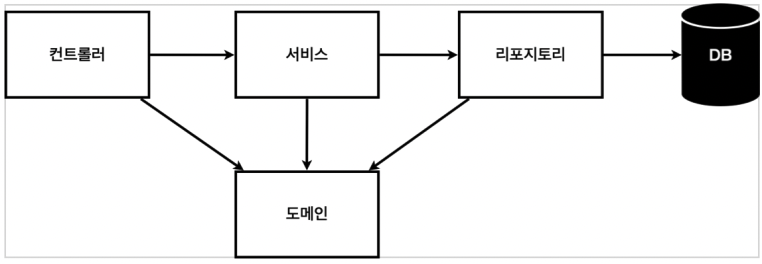
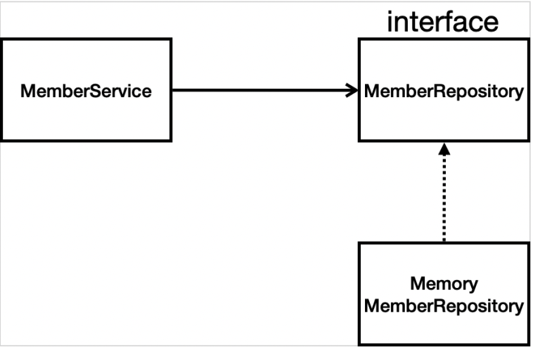

> 본 게시글은 [스프링 입문 - 코드로 배우는 스프링 부트, 웹 MVC, DB 접근 기술](https://www.inflearn.com/course/%EC%8A%A4%ED%94%84%EB%A7%81-%EC%9E%85%EB%AC%B8-%EC%8A%A4%ED%94%84%EB%A7%81%EB%B6%80%ED%8A%B8/) 강의를 듣고 필기용으로 정리했습니다.

#  ☘️ 회원 관리 예제 - 백엔드 개발

## 📌 비즈니스 요구사항 정리

- 정말 간단하게!
- 데이터: 회원ID, 이름
- 기능: 회원 등록, 조회
- <u>**아직 데이터 저장소가 선정되지 않음(가상의 시나리오)**</u>

### 일반적인 웹 애플리케이션 계층 구조



- 컨트롤러: 웹 MVC의 컨트롤러 역할
- 서비스: 핵심 비즈니스 로직 구현
- 리포지토리: 데이터베이스에 접근, 도메인 객체를 DB에 저장하고 관리
- 도메인: 비즈니스 도메인 객체, 예) 회원, 주문, 쿠폰 등등 주로 <u>데이터베이스에 저장하고 관리됨</u>

### 실습 클래스 의존관계



- 아직 데이터 저장소가 선장되지 않았으므로 저장소를 우선 인터페이스로 구현 클래스를 변경할 수 있도록 설계한다.
- 일단은 구현체로 메모리 기반의 데이터 저장소를 먼저 구현하고, 나중에 구현체를 바꿔끼운다.

## 📌 회원 도메인과 리포지토리 작성과 테스트

- 회원 리포지토리 인터페이스

  ```java
  public interface MemberRepository {
      Member save(Member member);
      Optional<Member> findById(Long id);
      Optional<Member> findByName(String name);
      List<Member> findAll();
  }
  ```

  - 요즘은 null을 그대로 반환하는 것 대신 `Optional`로 감싸서 처리한다. (Java8부터 추가)

- 회원 리포지토리 메모리 구현체

  ```java
  public class MemoryMemberRepository implements MemberRepository {
    
    	// 동시성 문제 있음
      private static Map<Long, Member> store = new HashMap<>();
      private static long sequence = 0L;
  
      @Override
      public Member save(Member member) {
        	// id는 시스템이 정해주고 이름은 고객이 입력
          member.setId(++sequence);
          store.put(member.getId(), member);
          return member;
      }
  
      @Override
      public Optional<Member> findById(Long id) {
          // null이 반환될 가능성이 있으니 Optional로 감싸서 반환해주자.
          return Optional.ofNullable(store.get(id));
      }
  
      @Override
      public Optional<Member> findByName(String name) {
          // 하나 찾으면 바로 반환
          return store.values().stream()
                  .filter(member -> member.getName().equals(name))
                  .findAny();
      }
    
      @Override
      public List<Member> findAll() {
          return new ArrayList<>(store.values());
      }
    
    	// 테스트 후 저장소 지우기
      public void clearStore() {
          store.clear();
      }
  }
  ```

  - 멤버를 저장할 때 그냥 `HashMap`으로 저장하고 있는데, 실무에서는 동시성 문제때문에 `ConcurrentHashMap`, `AtomicLong` 등을 고려해야 한다.

### 테스트 케이스 작성

- 동작하는 지 보기 위해 테스트를 작성해보자.
- 매번 main, controller를 통해 테스트한다면 은 준비하고 실행하는데 오래 걸리고, 반복 실행하기 어렵고 여러 테스트를 한번에 실행하기 어렵다는 단점이 있다. 자바는 JUnit이라는 프레임워크로 테스트를 실행해서 이러한 문제를 해결한다.

- 회원 리포지토리 메모리 구현체 테스트

  - `src/test/java` 하위 폴더에 같은 패키지에 클래스 이름 + Test를 붙여서 생성한다.

  ```java
  // 굳이 public일 필요는 없다.
  class MemoryMemberRepositoryTest {
      MemoryMemberRepository repository = new MemoryMemberRepository();
  
      @AfterEach
      public void afterEach() {
          repository.clearStore();
      }
  
      @Test
      public void save() {
          //given
          Member member = new Member();
          member.setName("spring");
          //when
          repository.save(member);
          //then
          Member result = repository.findById(member.getId()).get();
          // Assertions.assertEquals(result, member);
          assertThat(result).isEqualTo(member);
      }
  
      @Test
      public void findByName() {
          //given
          Member member1 = new Member();
          member1.setName("spring1");
          repository.save(member1);
          Member member2 = new Member();
          member2.setName("spring2");
          repository.save(member2);
          //when
          Member result = repository.findByName("spring1").get();
          //then
          assertThat(result).isEqualTo(member1);
      }
  
      @Test
      public void findAll() {
          //given
          Member member1 = new Member();
          member1.setName("spring1");
          repository.save(member1);
          Member member2 = new Member();
          member2.setName("spring2");
          repository.save(member2);
          //when
          List<Member> result = repository.findAll();
          //then
          assertThat(result.size()).isEqualTo(2);
      }
  }
  ```

  - 원랜 `Optional`을 그냥 get()으로 받아오면 별로지만 테스트니까 그냥 받아오자
  - 실무에서는 빌드 툴과 엮어서 테스트가 통과하지 못하면 다음 단계로 넘어가지 못하게 한다.
  - <u>**(단축키: 커맨드+옵션+V -> 선언부 채우기)**</u>
  - <u>**각 테스트의 순서는 보장이 안되고, 순서에 상관이 없도록 설계해야 한다.**</u>
    - 따라서 서로 영향을 주지 않도록, 테스트 하나가 끝나면 데이터를 클리어해줘야 한다.
    - `@AfterEach`: 각 테스트가 끝날 때마다 동작됨

  - 개발을 끝내고 테스트를 하냐? 테스트를 먼저 만들고 개발을 하냐? -> <mark>TDD...</mark>

## 📌 회원 서비스 개발과 테스트

### 회원 서비스

```java
public class MemberService {
    private final MemberRepository memberRepository = new MemoryMemberRepository();

    /**
     * 회원가입
     */
    public Long join(Member member) {
        validateDuplicateMember(member); //중복 회원 검증
        memberRepository.save(member);
        return member.getId();
    }

    private void validateDuplicateMember(Member member) {
        // 같은 이름이 있으면 가입 불가능
        memberRepository.findByName(member.getName())
                .ifPresent(m -> {
                    throw new IllegalStateException("이미 존재하는 회원입니다.");
                });
    }

    /**
     * 전체 회원 조회
     */
    public List<Member> findMembers() {
        return memberRepository.findAll();
    }

    public Optional<Member> findOne(Long memberId) {
        return memberRepository.findById(memberId);
    }
}
```

- Optional을 바로 반환하는 건 권장되지 않는다.  그래서 그냥 바로 `ifPresent`를 해주자.

- 뭔가 다른 로직이 있을 때는 메소드로 빼주는 게 좋다.
  - `Ctrl + T`: method로 검색하면 그 부분을 메소드로 뽑아낼 수 있다.

- 서비스 클래스의 메소드 네이밍은 좀 더 비즈니스에 가깝게 해야 한다. 그래야 찾아볼 때도 쉽고..
  - 서비스는 비즈니스를 처리하는 게 서비스의 역할이고, 리포지토리는 데이터 처리하는 게 역할이다.

- 그럼 진짜 이름이 같으면 exception이 터지는 지를 보자.

### 회원 서비스 테스트

- 테스트 하고 싶은 클래스에서 `command+shift+T`를 통해 테스트를 만들 수 있다.

- 테스트 메소드 이름은 한글로도 많이 적는다.
- 테스트 코드는 빌드될 때 실제 코드에 포함되지 않는다.
- 테스트 작성 시에는 <u>**given, when, then**</u>으로 주석을 표시해서 작성하는 게 도움이 된다. 그리고 상황에 안 맞을 때 점점 바꿔나가자.

### 예외 확인

- 예외를 확인하는 것이 정상 동작보다 중요할 수도 있다. 

- 예외를 확인할 때는 `try-catch`를 이용할 수도 있다.

  ```java
  @Test
  public void 중복_회원_예외() {
    // given
    Member member1 = new Member();
    member1.setName("spring");
    Member member2 = new Member();
    member2.setName("spring");
    
    // when
    memberService.join(member1);
    
    // 중복 이름이므로 예외가 터져야 한다.
    // try-catch 이용
    try {
      memberService.join(member2);
      fail(); // exception이 발생 안하고 여기 도달하면 실패
    } catch (IllegalStateException e) {
  		assertThat(e.getMessage()).isEqualTo("이미 존재하는 회원입니다.");
    }
  }
  ```

- 하지만 try-catch는 애매하니까(?) 제공되는 좋은 문법인 `assertThrows`를 사용해보자.

  - `assertThrows(터질 exception, 람다)`

  ```java
  @Test
  public void 중복_회원_예외() {
    // given
    Member member1 = new Member();
    member1.setName("spring");
    Member member2 = new Member();
    member2.setName("spring");
    // when
    memberService.join(member1);
    // 중복 이름이므로 예외가 터져야 한다.
    // try-catch 이용
    // try {
    //     memberService.join(member2);
    //     fail(); // exception이 발생 안하고 여기 도달하면 실패
    // } catch (IllegalStateException e) {
    //     assertThat(e.getMessage()).isEqualTo("이미 존재하는 회원입니다.");
    // }
    IllegalStateException e = assertThrows(IllegalStateException.class, () -> memberService.join(member2));
    assertThat(e.getMessage()).isEqualTo("이미 존재하는 회원입니다.");
  }
  ```

- 중간 코드

  ```java
  class MemberServiceTest {
  
      MemberService memberService = new MemberService();
  
      @Test
      public void 회원가입() throws Exception {
          //Given
          Member member = new Member();
          member.setName("hello");
          //When
          Long saveId = memberService.join(member);
          //Then
          Member findMember = memberService.findOne(saveId).get();
          assertThat(member.getName()).isEqualTo(findMember.getName());
      }
  
      @Test
      public void 중복_회원_예외() {
          // given
          Member member1 = new Member();
          member1.setName("spring");
          Member member2 = new Member();
          member2.setName("spring");
          // when
          memberService.join(member1);
  				
        	// then
          IllegalStateException e = assertThrows(IllegalStateException.class, () -> memberService.join(member2));
          assertThat(e.getMessage()).isEqualTo("이미 존재하는 회원입니다.");
      }
  
  ```

- 하지만 여기까지 문제점은 역시 테스트 끼리 영향을 줄 수 있다는 것이다. 따라서 repository를 매 메소드마다 비워줘야 한다.

- 어라라? 근데 지금은 `MemberService`밖에 없기 때문에 그 전 리포지토리 테스트처럼 clear를 해줄 수 없다.

- 그럼 `MemoryMemberRepository`를 선언해서 그 전 테스트와 같이 `@AfterEach`를 이용해서 비워주면 된다.

  ```java
  MemoryMemberRepository memoryRepository = new MemoryMemberRepository();
  
  @AfterEach
  public void afterEach(){
    memoryRepository.clearStore();
  }
  ```

- 위와 같이 추가하면 매 테스트가 끝나고 다시 clear를 한다.

- 어라라? 근데 `MemberService`와 관련 없이 다른 객체인데 어떻게 clear된 걸까?

  - `MemoryMemberRepository`에서 데이터를 저장할 때 static 맵을 쓰기 때문이다.

- 근데 사실 그래도 다른 객체를 만드는 건 좀 찝찝하고💦,  <u>**static이 아닐 때는 다른 인스턴스로 문제가 생길 것**</u>이다.

- 따라서 `MemberService`에서 repository를 <u>**외부에서 넣어주는 것**</u>으로 변경하자.

  ```java
  public class MemberService {
      private final MemberRepository memberRepository;
  
      public MemberService(MemberRepository memberRepository) {
          this.memberRepository = memberRepository;
      }
    // ...
  }
  ```

  ```java
  class MemberServiceTest {
      MemberService memberService;
      MemoryMemberRepository memoryRepository;
  
      @BeforeEach
      public void beforeEach(){
          memoryRepository = new MemoryMemberRepository();
          memberService = new MemberService(memoryRepository);
      }
    // ...
  }
  ```

  - `@BeforeEach`역시 각 메소드 전에 호출된다.

- 이렇게 직접 new를 하지 않고 외부에 넣어 주는 것을 `Dependency Injection(DI)`라고 한다.


```toc
```

