> 본 게시글은 [스프링 입문 - 코드로 배우는 스프링 부트, 웹 MVC, DB 접근 기술](https://www.inflearn.com/course/%EC%8A%A4%ED%94%84%EB%A7%81-%EC%9E%85%EB%AC%B8-%EC%8A%A4%ED%94%84%EB%A7%81%EB%B6%80%ED%8A%B8/) 강의를 듣고 필기용으로 정리했습니다.

#  ☘️ 스프링 DB 접근 기술

JPA도 스프링만큼 오래된 기술이다. JPA를 더 편리하게 쓸 수 있도록 감싼 게 스프링 데이터 JPA이다.

## 📌 H2 데이터베이스

보통 실무에서는 DB는 mysql, oracle을 활용한다.

H2 데이터베이스는 가볍고 교육용으로 좋다.

- 접속

  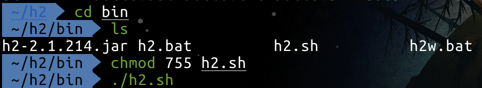

  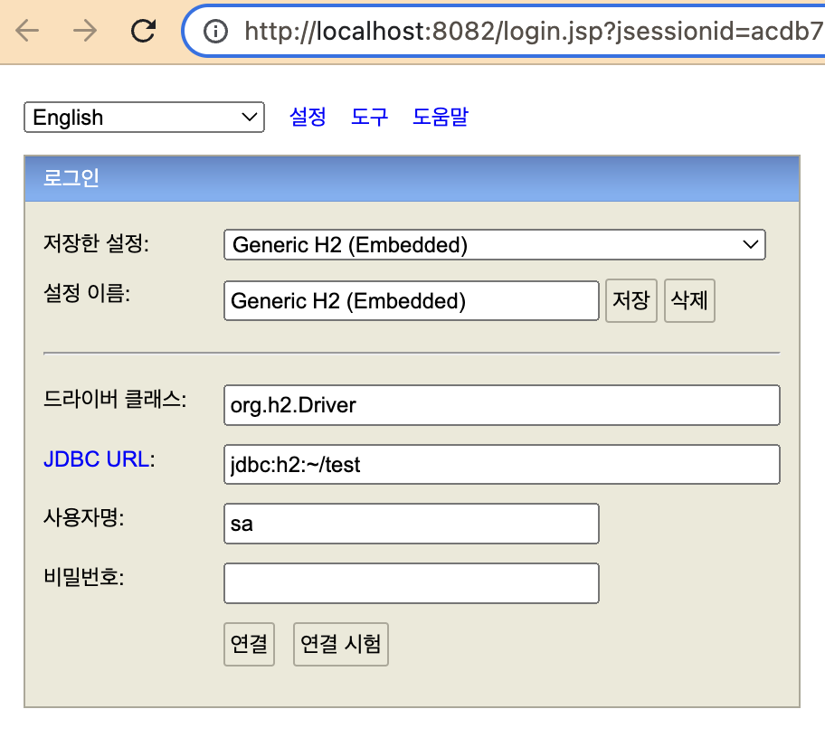

- 처음 이용할 때는 데이터베이스 파일을 만들어야 한다. `JDBC URL`에 파일 경로를 입력하자.

- JDBC URL에 경로 입력 후에 만약 test라는 이름으로 생성했다면 test.mv.db가 있는 지 확인하자.

  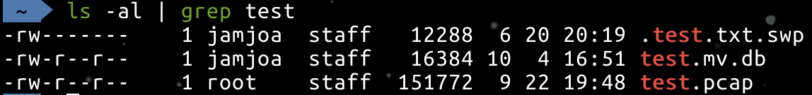

- 이렇게 파일 생성 이후에는 위에처럼 파일을 직접 접근하는 것이 아닌 소켓을 통해 접근해서 여러 곳에서 파일을 접근해도 문제가 없도록 해야 한다.

  - `jdbc:h2:tcp://localhost/~/test`

    


> ### h2 연결 오류 (카프카랑 같이 쓸 때 조심하세요...)
>
> 근데 여기서 계속 오류가 났다.
>
> `Connection is broken: "java.io.EOFException: localhost" [90067-210].`
>
> 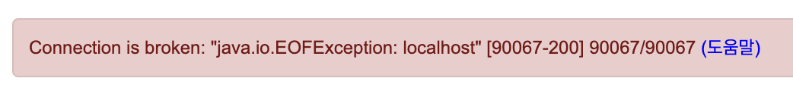도움말을 눌러서 보면
>
> > - #### CONNECTION_BROKEN_1
> >
> >   ```
> >   public static final int CONNECTION_BROKEN_1
> >   ```
> >
> >   The error with code `90067` is thrown when the client could not connect to the database, or if the connection was lost. Possible reasons are: the database server is not running at the given port, the connection was closed due to a shutdown, or the server was stopped. Other possible causes are: the server is not an H2 server, or the network connection is broken.
> >
> >   - **See Also:**
> >
> >     [Constant Field Values](https://h2database.com/javadoc/constant-values.html#org.h2.api.ErrorCode.CONNECTION_BROKEN_1)
>
> 무언가 소켓 연결에 문제가 생긴 걸 볼 수 있다.. 이거 때문에 설치하고 삭제하고 재부팅하고를 몇 번 반복했다.
>
> h2의 기본 포트는 `8082: 콘솔 브라우저 포트`, `9092: tcp 서버 포트`이다. 그래서 혹시 9092 포트가 겹쳐서 문제가 생기나 싶어서 해당 포트를 쓰는 프로세스를 확인해줬다.
>
> ```shell
> # 맥 기준
> lsof -i :9092
> kill -9 {해당 PID}
> ```
>
> 위 명령어로 9092 포트를 쓰는 프로세스를 kill하고 다시 실행해도 계속 되지 않았다..
>
> 근데 `h2.sh`로 h2를 실행할 때 포트를 명시하는 방법이 있어서
>
> ```shell
> ./h2/bin/h2.sh -tcpPort 9292
> ```
>
> 위 명령어로 9292에서 실행한 뒤에 `jdbc:h2:tcp://localhost:9292/~/test`로 포트번호를 명시한 뒤에 연결했더니 됐다!
>
> ---------
>
> 내 생각에 원인은 <u>**카프카(Kafka)가 설치되어 있던 것**</u> 때문이다.
>
> <u>**카프카의 기본 포트는 9092다. h2의 기본 포트 역시 9092**</u>다.
>
> 근데 나는 brew로 카프카가 설치되어 있던 경우라서, 예전에 `brew services start kafka`로 카프카가 실행되어 있던 게 계속 실행되고 있었고, 해당 프로세스를 수동으로 kill해도 brew가 계속 카프카를 실행해줬던 것으로 보인다.
>
> 그리고 h2를 실행하고 tcp로 연결할 때 기본 포트 9092가 사용 중이여도 경고(already in use같은..)가 따로 뜨지 않고, 그냥 위에처럼 Connection is broken이 나온다.
>
> 포트를 확인해보면
>
> - 카프카가 9092 포트를 쓰고 있다가
>
>   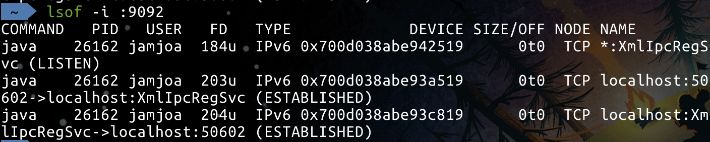
>
>   - 위에 PID 26162가 카프카 프로세스다
>
>     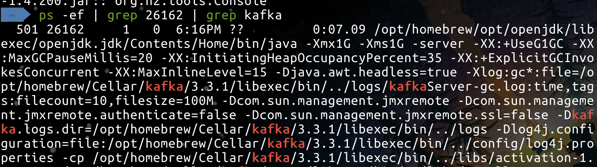
>
> - h2에 tcp로 접속을 시도하면 9092 포트에 <u>**closed 소켓이 증가**</u>한 걸 볼 수 있다..
>
>   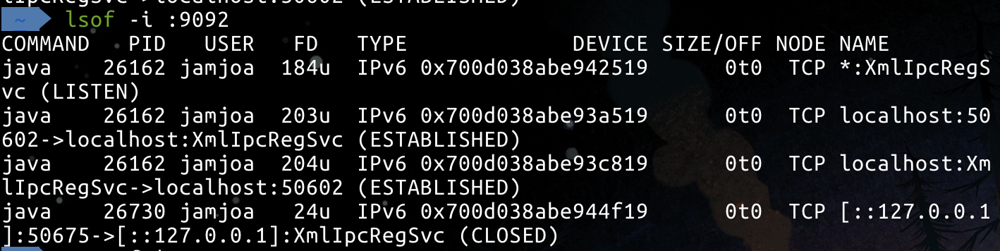
>
>   - 그리고 이 26730번 프로세스는 h2 프로세스다. 아마 h2가 9092로 연결하려다가 already in use라 소켓이 그냥 닫혀버린 것으로 추측할 수 있다. 이거 경고가 안 떠서 한참 삽질....
>
>     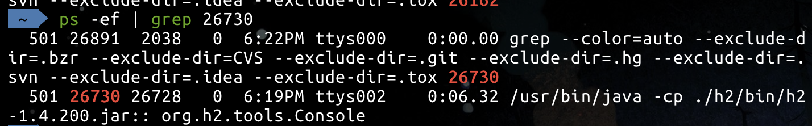
>
>   - 그냥 기본으로 `./h2.sh`말고 `./h2.sh -tcpPort 9092`로 실행하면 already in use가 뜬다.
>
>     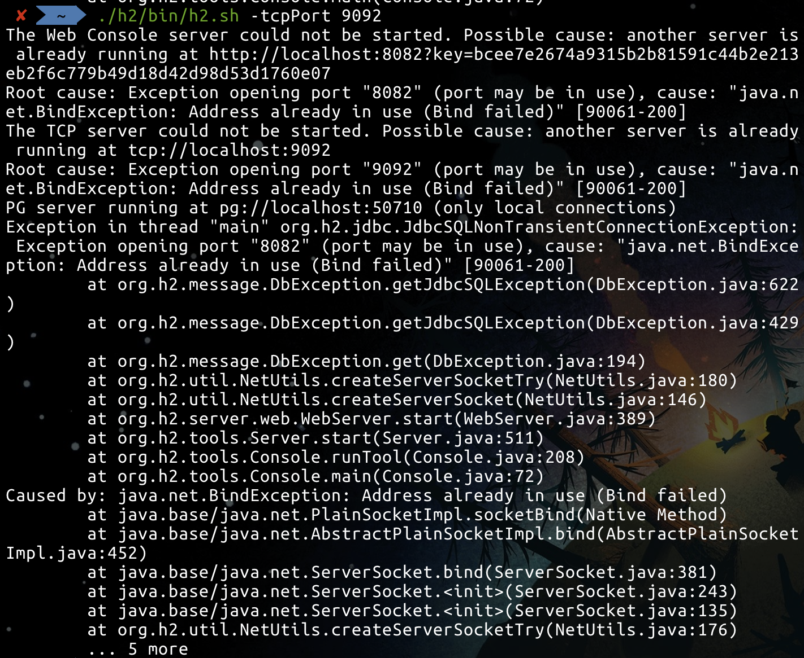
>
> - 그래서 kafka를 `brew services stop kafka` stop 시켜준 뒤에, 포트를 쓰고 있는 프로세스를 확인하면 다 닫혀있다.
>
>   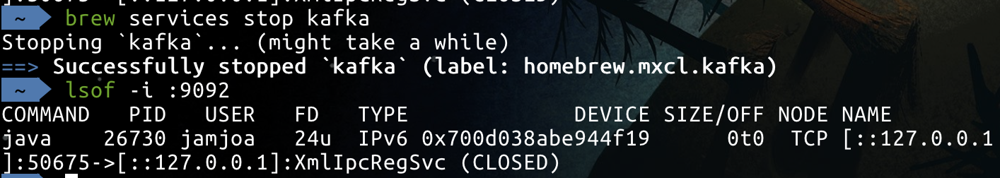
>
> - 이 상태에서 연결을 다시 하면? 잘 된다!
>
>   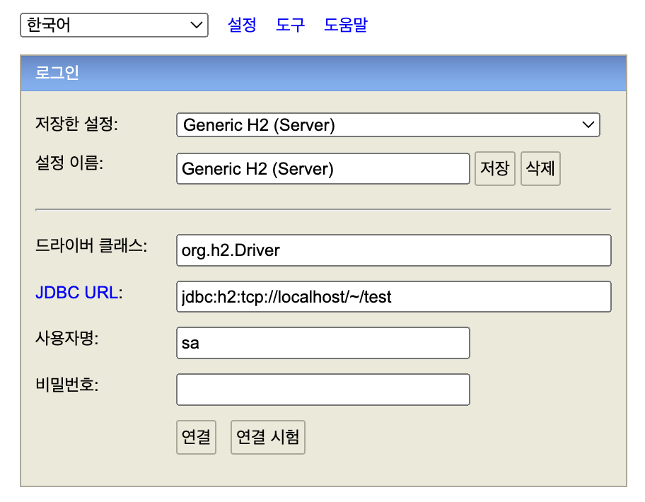
>
> - 삽질한게 짜증나서 카프카를 삭제했다 ^^

### member 테이블 생성

```sql
drop table if exists member CASCADE;
create table member
(
 id bigint generated by default as identity,
 name varchar(255),
 primary key (id)
);
```

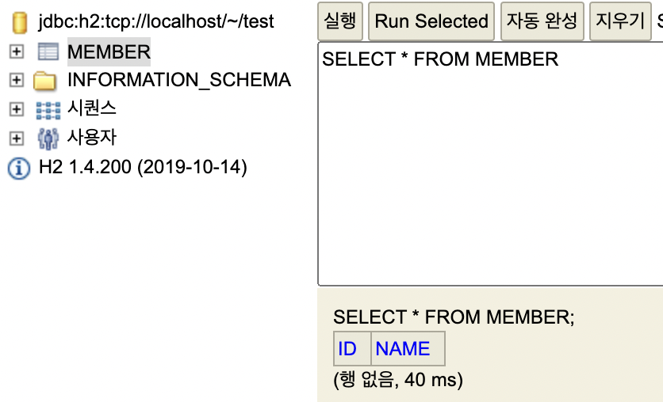

- h2 콘솔 말고도 인텔리제이에서 database에 추가해서 작업할 수도 있다.

이 때 sql 쿼리들 역시 편리하게 관리하기 위해서 루트 디렉터리 아래에 `sql` 디렉터리를 만들고 `ddl.sql`로 만들어서 관리해주자. <u>**git을 사용하니까 sql 역시 이렇게 프로젝트 내에 포함해서 관리하는 게 더 좋은 것 같다!**</u>

## 📌 순수 JDBC

20년도 더 전에 하던 방법이지만 간단하게 알아보자!

### build.gradle

```groovy
implementation 'org.springframework.boot:spring-boot-starter-jdbc'
runtimeOnly 'com.h2database:h2'
```

- 자바는 db와 연결하기 위해 jdbc 드라이버가 필요하다.
- db와 붙을 때 데이터베이스가 제공하는 클라이언트로 h2database

### db 정보 설정하기

application.properties에 설정해주자

```properties
spring.datasource.url = jdbc:h2:tcp://localhost/~/test
spring.datasource.driver-class-name=org.h2.Driver
spring.datasource.username=sa
```

### JdbcMemberRepository 

```java
public class JdbcMemberRepository implements MemberRepository {

    private final DataSource dataSource;

    public JdbcMemberRepository(DataSource dataSource) {
        this.dataSource = dataSource;
    }

    @Override
    public Member save(Member member) {
        String sql = "insert into member(name) values(?)";
        Connection conn = null;
        PreparedStatement pstmt = null;
        ResultSet rs = null;
        try {
            conn = getConnection();
            // sql 실행 후에 insert된 멤버의 id를 얻어오기 위해 generated_keys 옵션을 넣어준다.
            pstmt = conn.prepareStatement(sql,
                    Statement.RETURN_GENERATED_KEYS);
            pstmt.setString(1, member.getName());
            pstmt.executeUpdate();
            rs = pstmt.getGeneratedKeys();
            // 얻어온 id 값으로 member의 id 세팅해준다.
            if (rs.next()) {
                member.setId(rs.getLong(1));
            } else {
                throw new SQLException("id 조회 실패");
            }
            return member;
        } catch (Exception e) {
            throw new IllegalStateException(e);
        } finally {
            // close를 안해주면 connection이 계속 쌓여서 장애가 날 수도 있다.
            close(conn, pstmt, rs);
        }
    }

    @Override
    public Optional<Member> findById(Long id) {
        String sql = "select * from member where id = ?";
        Connection conn = null;
        PreparedStatement pstmt = null;
        ResultSet rs = null;
        try {
            conn = getConnection();
            pstmt = conn.prepareStatement(sql);
            pstmt.setLong(1, id);
            rs = pstmt.executeQuery();
            if (rs.next()) {
                Member member = new Member();
                member.setId(rs.getLong("id"));
                member.setName(rs.getString("name"));
                return Optional.of(member);
            } else {
                return Optional.empty();
            }
        } catch (Exception e) {
            throw new IllegalStateException(e);
        } finally {
            close(conn, pstmt, rs);
        }
    }

    @Override
    public List<Member> findAll() {
        String sql = "select * from member";
        Connection conn = null;
        PreparedStatement pstmt = null;
        ResultSet rs = null;
        try {
            conn = getConnection();
            pstmt = conn.prepareStatement(sql);
            rs = pstmt.executeQuery();
            List<Member> members = new ArrayList<>();
            while (rs.next()) {
                Member member = new Member();
                member.setId(rs.getLong("id"));
                member.setName(rs.getString("name"));
                members.add(member);
            }
            return members;
        } catch (Exception e) {
            throw new IllegalStateException(e);
        } finally {
            close(conn, pstmt, rs);
        }
    }

    @Override
    public Optional<Member> findByName(String name) {
        String sql = "select * from member where name = ?";
        Connection conn = null;
        PreparedStatement pstmt = null;
        ResultSet rs = null;
        try {
            conn = getConnection();
            pstmt = conn.prepareStatement(sql);
            pstmt.setString(1, name);
            rs = pstmt.executeQuery();
            if (rs.next()) {
                Member member = new Member();
                member.setId(rs.getLong("id"));
                member.setName(rs.getString("name"));
                return Optional.of(member);
            }
            return Optional.empty();
        } catch (Exception e) {
            throw new IllegalStateException(e);
        } finally {
            close(conn, pstmt, rs);
        }
    }

    // DataSourceUtils를 통해 connection을 받아야 트랜잭션 같은 게 걸리면 connection을 유지해준다.
    private Connection getConnection() {
        return DataSourceUtils.getConnection(dataSource);
    }

    // 순서대로 해제해줘야 해서 복잡하다.
    private void close(Connection conn, PreparedStatement pstmt, ResultSet rs) {
        try {
            if (rs != null) {
                rs.close();
            }
        } catch (SQLException e) {
            e.printStackTrace();
        }
        try {
            if (pstmt != null) {
                pstmt.close();
            }
        } catch (SQLException e) {
            e.printStackTrace();
        }
        try {
            if (conn != null) {
                close(conn);
            }
        } catch (SQLException e) {
            e.printStackTrace();
        }
    }

    private void close(Connection conn) throws SQLException {
        DataSourceUtils.releaseConnection(conn, dataSource);
    }
}
```

- db에 붙으려면 데이터 소스가 필요하다. 그리고 스프링에게 주입받아야 한다. (properties에 세팅한 대로 주입받을 수 있다)
- 데이터 소스로부터 getConnection을 하면, 진짜 db와 연결된 그 소켓을 받을 수 있다. 그 커넥션에 쿼리를 날리면 된다.
- insert는 update 조회일 땐 execute...

그리고 SpringConfig에 등록해놨던 `MemberRepository` 빈 구현체를 위에서 만든 `JdbcMemberRepository`로 바꿔주자.

- <u>**이렇게 설정만 바꾸면 다른 부분 건드리지 않고도 간단하게 구현체를 바꿀 수 있다!**</u>
- 객체지향적인 설계 -> <mark>다형성</mark> 활용
  - 이게 굉장히 편리하게 되도록 스프링이 지원해준다.
  - 보통은 각 코드에서 직접 다 고쳐야 하지만, 설정 코드만 바꿔도 된다!

```java
@Configuration
public class SpringConfig {
    //...
    @Bean
    public MemberRepository memoryMemberRepository() {
        // return new MemoryMemberRepository();
        return new JdbcMemberRepository(dataSource);
    }
}
```

이제 스프링을 껐다 켜도 h2 db에 저장되기 때문에 날아가지 않는다!

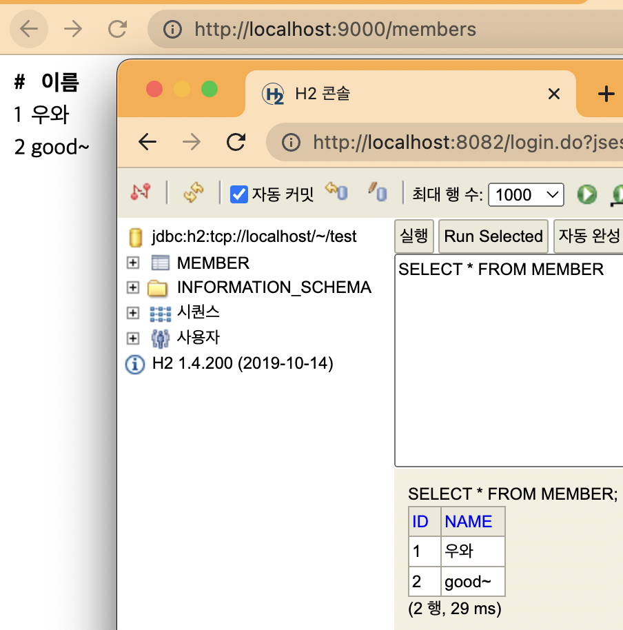

### OCP

- <u>개방 폐쇄 원칙</u> `Open-Closed Principle`
  - 확장에는 열려있고, 수정에는 닫혀있다.
- <u>**인터페이스 등으로 객체 지향에서 말하는 다형성을 잘 활용하면 기능을 완전 변경해도 애플리케이션 전체를 수정할 필요가 없다!**</u> (조립하는 코드만 바꾸면)
- 스프링 <u>Dependencies Injection</u>을 통해 기존 코드 변경 없이 구현 클래스를 변경할 수 있었다.
- 이 경우 개방 폐쇄 원칙이 지켜졌다!

- 객체 지향의 진짜 매력 ✨

## 📌 스프링 통합 테스트

그럼 이제 db 연결을 했으니 테스트도 스프링과 db를 다 올려서 해봐야겠죠?

- 스프링 테스트할 때는 `@SpringBootTest`를 Test에 붙여주면 된다. 그리고 `@Tracsactional`도 붙여주자.

  ```java
  @SpringBootTest
  @Transactional
  class MemberServiceIntegrationTest {
    //...
  }
  ```

- `@BeforeEach`로 객체 생성하던 것에서, 이제 스프링으로부터 주입을 받아야 한다. 테스트니깐 굳이 생성자 주입 필요 없이 그냥 필드 주입으로 해도 괜찮다.
  - 어차피 다른 곳에서 또 쓰일 일이 없고 테스트 하면 끝이기 때문이다.
  - 또한 구현체를 스프링으로부터 받을 것이므로 `MemoryMemberRepository`대신에 `MemberRepository`로 선언해도 괜찮다.
  - `@AfterEach`로 매번 지워주던 것이 `@Transactional` 덕분에 필요가 없다.
    - 테스트할 때는 보통 테스트 전용 db를 따로 구축한다.

### `@SpringBootTest`

- 스프링 컨테이너와 테스트 함께 실행한다

### `@Transactional`

- 테스트 케이스에 이 애노테이션이 있으면, 테스트 시작 전에 트랜잭션을 시작하고, 테스트 완료 후에 항상 롤백한다. 이렇게 하면 DB에 데이터가 남지 않으므로 다음 테스트에 영향을 주지 않는다.

> 물론 test말고 service 등등 다른 곳에서는 롤백하지 않는다.
>
> `@Commit` 같이 커밋해준다거나 하는 다른 옵션도 있다.

### `Unit Test` Vs. `Integration Test`

그 전에 스프링 없이 했던 테스트는 순수하게 자바 코드로, 최소한의 단위로 테스트했다. 이걸 <u>**단위 테스트**</u>라고 한다.

그리고 스프링 컨테이너, db 등을 연동해서 테스트하는 것을 <u>**통합 테스트**</u>라고 한다.

가급적이면 순수한 <u>**단위 테스트가 더 좋은 테스트일 확률이 높다**</u>. 따라서 <u>**단위 대로 쪼개서 테스트를 잘 하고, 스프링 없이도 테스트할 수 있도록 훈련**</u>하는 편이 좋다. 컨테이너를 꼭 올려야 한다면 테스트 설계가 잘못됐을 확률이 있다.

## 📌 스프링 JdbcTemplate

스프링 jdbcTemplate 라이브러리 MyBatis와 비슷한 라이브러리다. 이 라이브러리는 JDBC API에서 반복 코드를 제거해준다. 하지만 역시 SQL은 직접 작성해야 한다.

> 디자인 패턴 중 템플릿 메소드 패턴을 이용해서 코드를 많이 줄여서 JdbcTemplate이라고 한다.

요건 실무에서도 많이 쓴다.

- `JdbcTemplateMemberRepository`

  ```java
  public class JdbcTemplateMemberRepository implements MemberRepository {
      private final JdbcTemplate jdbcTemplate;
  
      @Autowired
      public JdbcTemplateMemberRepository(DataSource dataSource) {
          this.jdbcTemplate = new JdbcTemplate(dataSource);
      }
  }
  ```

  - jdbcTemplate을 주입받는 것은 아니고, DataSource를 주입받아서 jdbcTemplate을 생성해준다.

  ```java
  public class JdbcTemplateMemberRepository implements MemberRepository {
      private final JdbcTemplate jdbcTemplate;
  
      @Autowired
      public JdbcTemplateMemberRepository(DataSource dataSource) {
          this.jdbcTemplate = new JdbcTemplate(dataSource);
      }
  
      @Override
      public Member save(Member member) {
          // 쿼리를 짤 필요가 없다.
          SimpleJdbcInsert jdbcInsert = new SimpleJdbcInsert(jdbcTemplate);
          jdbcInsert.withTableName("member").usingGeneratedKeyColumns("id");
  
          Map<String, Object> parameters = new HashMap<>();
          parameters.put("name", member.getName());
  
          Number key = jdbcInsert.executeAndReturnKey(new MapSqlParameterSource(parameters));
          member.setId(key.longValue());
          return member;
      }
  
      @Override
      public Optional<Member> findById(Long id) {
          List<Member> result = jdbcTemplate.query("select * from member where id = ?",
                  memberRowMapper(), id);
          return result.stream().findAny();
      }
  
      @Override
      public List<Member> findAll() {
          return jdbcTemplate.query("select * from member",
                  memberRowMapper());
      }
  
      @Override
      public Optional<Member> findByName(String name) {
          List<Member> result = jdbcTemplate.query("select * from member where name = ?",
                  (rs, rowNum) -> {
                      Member member = new Member();
                      member.setId(rs.getLong("id"));
                      member.setName(rs.getString("name"));
                      return member;
                  }, name);
          return result.stream().findAny();
      }
  
      // 결과 mapping
      private RowMapper<Member> memberRowMapper() {
          // return new RowMapper<Member>() {
          //     @Override
          //     public Member mapRow(ResultSet rs, int rowNum) throws SQLException {
          //         Member member = new Member();
          //         member.setId(rs.getLong("id"));
          //         member.setName(rs.getString("name"));
          //         return member;
          //     }
          // };
  
          // 위에랑 같은데 람다로
          return (rs, rowNum) -> {
              Member member = new Member();
              member.setId(rs.getLong("id"));
              member.setName(rs.getString("name"));
              return member;
          };
      }
  }
  ```

<u>**테스트를 잘 작성하는 것에 대해서 항상 고민해야 한다.**</u> 실제로 60~70퍼센트는 테스트 코드를 작성한다.

## 📌 JPA: Java Persistence API

JdbcTemplate을 사용하니, 반복적인 코드가 확 줄었다. 하지만 <u>**결국 sql을 개발자가 직접 작성해야한다.**</u>

JPA라는 기술을 사용하면 쿼리도 자동으로 생성해준다!
- 그 전에 메모리 db를 사용했던 것처럼 그냥  JPA에 집어넣으면 처리해준다.

JPA를 사용하면, <u>SQL과 데이터 중심의 설계</u>에서 <u>**객체 중심의 설계**</u>로 패러다임을 전환을 할 수 있다. 개발 생산성을 크게 높일 수 있다.

JPA도 스프링만큼 넓고 깊이가 있는 기술이다. 스프링만큼 깊게 공부해야 한다.

스프링에서도 JPA를 굉장히 많이 지원한다.

###  Interface

JPA는 인터페이스고, 구현체로  hibernate 등등이 있다. 거의 hibernate 사용한다. 기본적으로 JPA는 오픈소스 hibernate 구현체가 사용된다.

### ORM

JPA는 ORM 기술이다. 객체(Object)와 관계형(Relational) DB의 테이블을 Mapping한다.

### build.gradle

```groovy
//implementation 'org.springframework.boot:spring-boot-starter-jdbc'
implementation 'org.springframework.boot:spring-boot-starter-data-jpa'
```

- data-jpa가 jdbc를 포함한다.

### application.properties

```properties
# jpa가 날려주는 쿼리 보기 
spring.jpa.show-sql=true
# jpa 사용 시 객체를 보고 테이블을 만들어주는데, 위에서 이미 만들었으므로 기능 끄기 (create일 시 생성)
spring.jpa.hibernate.ddl-auto=none
```

### `@Entity`

JPA가 관리하는 객체임을 알려주기 위해 객체에 어노테이션 추가한다.

- `@id`

  PK를 명시해주자.

  그리고 이 경우 id를 db가 자동 생성해주고 있었다. 이름 <u>**identity 전략**</u>이라고 한다. 해당 id가 db가 자동 생성되는 것임을 명시해주자.

  -> `@GeneratedValue(strategy = GenerationType.IDENTITY)`

- `@Column`

  객체 이름과  db의 column 이름이 다르다면 명시해주면 된다.

  예) `@Column(name = "username")`

 ```java
 @Entity
 public class Member {
     @Id
     @GeneratedValue(strategy = GenerationType.IDENTITY)
     private Long id;
     // ...
 }
 ```

### `JpaMemberRepository`

Jpa는 `EntityManager`를 기반으로 모든 게 동작한다. 이것 역시 위에 `DataSource`처럼 스프링이 설정을 바탕으로 만들어준다. 따라서 주입받으면 된다.

```java
private final EntityManager em;

public JpaMemberRepository(EntityManager em) {
  this.em = em;
}
```

### 저장하기

```java
@Override
public Member save(Member member) {
  // 영속화, 영구 저장
  em.persist(member);
  return member;
}
```

### pk값으로 객체 찾기

```java
@Override
public Member save(Member member) {
  // 영속화, 영구 저장
  em.persist(member);
  return member;
}
```


### 그 외 값으로 객체 찾기

pk 기반이 아니므로 <u>**JPQL**</u>이라는 객체 지향 쿼리 언어를 사용해야 한다.
테이블이 아닌 <u>**객체(엔티티) 를 대상으로 쿼리를 날리는 것**</u>


```java
@Override
public List<Member> findAll() {
  return em.createQuery("select m from Member m", Member.class)
    .getResultList();
}
```

- JdbcTemplate이라면 Member로부터 id, name 등등 다 받아오고 또 객체 맵핑해주고... 이럴 필요 없이 그냥 객체를 가져올 수 있다!

```java
@Override
public Optional<Member> findByName(String name) {
  List<Member> result = em.createQuery("select m from Member m where m.name = :name", Member.class)
    .setParameter("name", name) // ? 넣어주기
    .getResultList();
  return result.stream().findAny();
}
```

+) 스프링 데이터 JPA는 JPA 기술을 스프링이 한 번 감싸서 제공해준다. 그 때는 findByName, findAll도 JPQL을 사용할 필요가 없다!

### 전체 코드

```java
public class JpaMemberRepository implements MemberRepository {
    private final EntityManager em;

    @Autowired
    public JpaMemberRepository(EntityManager em) {
        this.em = em;
    }

    @Override
    public Member save(Member member) {
        em.persist(member);
        return member;
    }

    @Override
    public Optional<Member> findById(Long id) {
        Member member = em.find(Member.class, id);
        return Optional.ofNullable(member);
    }

    @Override
    public Optional<Member> findByName(String name) {
        List<Member> result = em.createQuery("select m from Member m where m.name = :name", Member.class)
                .setParameter("name", name)
                .getResultList();
        return result.stream().findAny();
    }

    @Override
    public List<Member> findAll() {
        return em.createQuery("select m from Member m", Member.class)
                .getResultList();
    }
}
```


### ⚠️ `@Transactional`

JPA를 사용할 땐(데이터를 저장하거나 변경할 때) 항상 이 어노테이션이 있어야 한다.

Service 계층에 추가해주자.

- 클래스 단위에 추가해줘도 되고, save 등을 하는 특정 메소드에만 추가해도 된다. 

###  설정 파일

- MemberRepository 구현체를 또 바꿔 끼울 시간이다. 이 때 EntityManager를 주입받아서 JpaMemberRepository 생성자에 넘겨주자.

  ```java
  @Configuration
  public class SpringConfig {
  
      private EntityManager em;
  
      @Autowired
      public SpringConfig(EntityManager em) {
          this.em = em;
      }
  
      @Bean
      public MemberRepository memoryMemberRepository() {
          return new JpaMemberRepository(em);
      }
  }
  
  ```

  

## 📌 스프링 데이터 JPA

> 스프링 부트와 JPA만 사용해도 개발 생산성이 정말 많이 증가하고, 개발해야할 코드도 확연히 줄어듭니다. 여기에 스프링 데이터 JPA를 사용하면, 기존의 한계를 넘어 마치 마법처럼, 리포지토리에 구현 클래스 없이 인터페이스 만으로 개발을 완료할 수 있습니다.
>
> - 어쨌든  save, find 등등의 내부 구현을 했어야 했는데..! 인터페이스만 있어도 된다.
>
> 그리고 반복 개발해온 기본 CRUD 기능도 스프링 데이터 JPA가 모두 제공합니다. 스프링 부트와 JPA라는 기반 위에, 스프링 데이터 JPA라는 환상적인 프레임워크를 더하면 개발이 정말 즐거워집니다. 지금까지 조금이라도 단순하고 반복이라 생각했던 개발 코드들이 확연하게 줄어듭니다. 따라서 개발자는 핵심 비즈니스 로직을 개발하는데, 집중할 수 있습니다. 실무에서 관계형 데이터베이스를 사용한다면 스프링 데이터 JPA는 이제 선택이 아니라 필수 입니다.
>
> > ⚠️ 주의: 스프링 데이터 JPA는 JPA를 편리하게 사용하도록 도와주는 기술입니다. 따라서 JPA를 먼저 학습한 후에 스프링 데이터 JPA를 학습해야 합니다.
> >
> > (그래서 JPA 강의 코스도 JPA를 먼저 하고 스프링 데이터 JPA)
> >
> > 스프링 데이터 JPA는 어디까지나 JPA를 도와주는 것이므로 JPA 자체를 모르고 사용하면 맞닥뜨리는 여러 문제를 해결할 수가 없다. 그리고 JPA를 배우고 스프링 데이터 JPA를 배우면 쉽게 배울 수 있다! 

### Interface

인터페이스만 만들면 구현할 게 없다 ^-^! 와!

JpaRepository를 확장한 인터페이스가 있으면 이걸 읽고 알아서 스프링 빈에 프록시라는 기술을 이용해서 구현체를 만들어서 자동으로 등록해준다. 그래서 그냥 주입받으면 된다. 

```java
public interface SpringDataJpaMemberRepository extends JpaRepository<Member, Long>, MemberRepository {

}
```

- 와! 이것만 만들어놓고 구현체가 필요할 때는 주입받아서 사용하면 된다. 

  ```java
  private MemberRepository memberRepository;
  
  @Autowired
  public SpringConfig(MemberRepository memberRepository) {
    	this.memberRepository = memberRepository;
  }
  ```

- 기본적인  CRUD, 조회 등 공통 메소드가 다 만들어져 있다. 하지만 공통적이지 않은 것들은 당연히 공통으로 만들어 놓을 수가 없다. 그래서 interface를 만들어서 규칙을 지켜서 메소드를 만들면 된다.

  - 예)

    ```java
    // JPQL로는 select m from Member m where m.name = ?
    Optional<Member> findByName(String name); 
    ```

    +) `findByNameAndId` `findByNameOrId` ... 등등 굉장히 많다. 웬만큼은 이걸로 해결이 된다.

  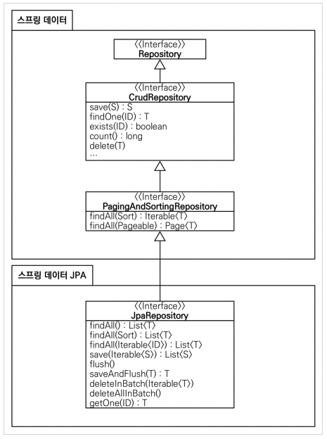

- 페이징 기능도 자동으로 제공해준다

> 실무에서는 JPA와 스프링 데이터 JPA를 기본으로 사용하고, 복잡한 <u>동적 쿼리</u>는 <u>Querydsl</u>이라는 라이브러리를 사용하면 된다. Querydsl을 사용하면 쿼리도 자바 코드로 안전하게 작성할 수 있고, 동적 쿼리도 편리하게 작성할 수 있다. 이 조합으로 해결하기 어려운 쿼리는 JPA가 제공하는 <u>네이티브 쿼리</u>를 사용하거나, 앞서 학습한 <u>스프링 JdbcTemplate</u>를 사용하면 된다.


```toc
```

