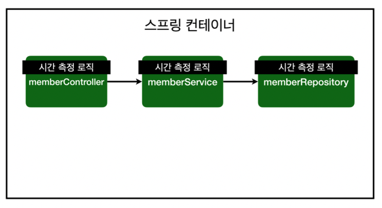
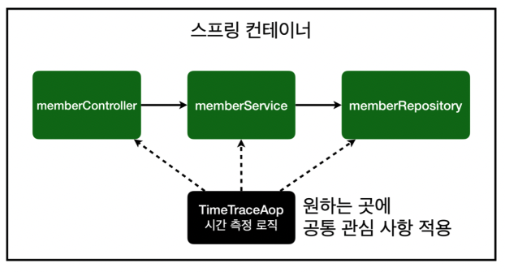
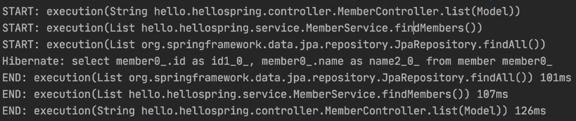
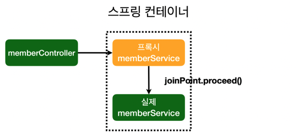
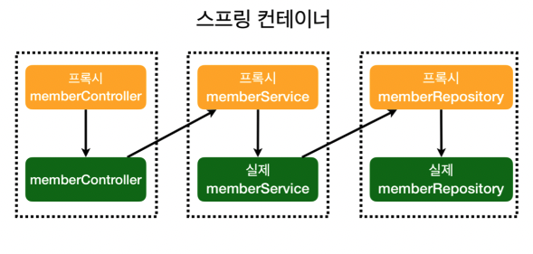

> 본 게시글은 [스프링 입문 - 코드로 배우는 스프링 부트, 웹 MVC, DB 접근 기술](https://www.inflearn.com/course/%EC%8A%A4%ED%94%84%EB%A7%81-%EC%9E%85%EB%AC%B8-%EC%8A%A4%ED%94%84%EB%A7%81%EB%B6%80%ED%8A%B8/) 강의를 듣고 필기용으로 정리했습니다.

#  ☘️ AOP

<u>**Aspect Oriented Programming: 관점 지향 프로그래밍**</u>

## 📌 AOP가 필요한 상황

한 상황을 가정해보자. 메소드가 쭉 있는데.. 모든 메소드의 호출 시간을 측정하고 싶으면 어떻게 할까?

모든 메소드를 다 돌면서 타이머 누르고, 완료 시에 시간 재고.. 이걸 모두 추가해야한다! 만약 시간 측정 단위를 바꾸고 싶으면? 모든 메소드를 다시 돌면서 또 수정해야 한다.

### 문제: <u>**공통 관심 사항(cross-cutting concern) vs 핵심 관심 사항(core concern)**</u>

- 시간을 측정하는 기능은 핵심 관심 사항이 아니다.  공통 관심 사항이다.
- 시간을 측정하는 로직과 핵심 비즈니스의 로직이 섞여서 유지보수가 어렵다.
- 시간을 측정하는 로직을 변경할 때 모든 로직을 찾아가면서 변경해야 한다.
- 그렇다고 시간을 측정하는 로직을 별도의 공통 로직으로 만들기 매우 어렵다.

이런 문제를 해결하는 기술을 <u>**AOP**</u>라고 한다.

## 📌 AOP 적용

AOP는 <u>**공통 관심 사항과 핵심 관심 상황을 분리하는 것**</u>이다.

|  | ➡️    |  |
| ------------------------------------------------------------ | ---- | ------------------------------------------------------------ |

- 공통 관심 사항을 모아놓고 원하는 곳을 지정해주면 된다. 

스프링에선 AOP 기술을 잘 활용할 수 있도록 여러 가지를 제공해준다!

위에 시간 측정 로직을 한 번 작성해보자.

```java
@Component
@Aspect
public class TimeTraceAop {
  @Around("execution(* hello.hellospring..*(..))")
  public Object execute(ProceedingJoinPoint joinPoint) throws Throwable {
    long start = System.currentTimeMillis();
    System.out.println("START: " + joinPoint.toString());
    try {
      return joinPoint.proceed();
    } finally {
      long finish = System.currentTimeMillis();
      long timeMs = finish - start;
      System.out.println("END: " + joinPoint.toString()+ " " + timeMs +
                         "ms");
    }
}
```

- `joinPoint.proceed()`는 다음 메소드들로 진행시키는 것이고, 결과를 받을 수 있다. 결과를 리턴해줘야 한다.

- 이 때 스프링에 등록해주기 위해 `@Component`를 사용할 수도 있지만, 뭔가 정형화된 것이 아니니까 SpringConfig 설정 클래스에 등록해주는 게 더 좋을 수도 있다.

  ```java
  @Configuration
  public class SpringConfig {
  	//...
    @Bean
    public TimeTraceAop timeTraceAop() {
      return new TimeTraceAop();
    }
  }
  ```

- 공통 관심 사항을 어디 어디에 적용할 것인 지를 `@Around`에 정해진 문법대로 작성해준다. 이 경우 hello.hellospring 패키지 아래에 다 적용한다는 의미이다.

- joinPoint를 통해 실행되는 메소드 등등의 정보를 얻을 수 있다.

  

### 해결

- 시간을 측정하는 로직을 별도의 공통 로직으로 만들었다.
- 핵심 관심 사항을 깔끔하게 유지할 수 있다.
- 변경이 필요하면 이 로직만 변경하면 된다.
- 원하는 적용 대상을 선택할 수 있다.

## 📌 스프링의 AOP 동작 방식: <u>**프록시 방식의 AOP**</u>

| 적용 전 의존 관계                                            | ➡️    | 적용 후 의존 관계                                            |
| ------------------------------------------------------------ | ---- | ------------------------------------------------------------ |
|  |      |  |

- 적용 후 동작 방식

  가짜(프록시) memberService를 만들어서, 빈으로 등록할 때 진짜 스프링 빈 대신 가짜 스프링 빈을 앞에 세워두고, 가짜 스프링 빈이 끝나면 진짜 스프링 빈을 호출해준다. (프록시에 대한 자세한 건 나중에~!)

- 실제로 memberService 빈의 Class를 직접 출력해보면 아래와 같이 나온다.

  ```java
  System.out.println("memberService = " + memberService.getClass());
  ```

  

  - 그냥 `MemberService`로 끝나는 게 아니고 뭐가 붙어 있다. 원래 클래스를 가지고 코드를 복사해서 쓰는 어떤 기술이라고 한다.

- 따라서 결국은 아래와 같이 되는 것이다.

  | 적용 전 전체 그림                                            | ➡️    | 적용 후 전체 그림                                            |
  | ------------------------------------------------------------ | ---- | ------------------------------------------------------------ |
  |  |      |  |

- 이건 모두 스프링이 컨테이너에서 스프링 빈을 관리하므로 가짜를 만들어서 DI를 해주면 되기 때문에 가능한 것이다.
  - <u>**DI의 장점! ✨**</u> 

----------------------

➕ 추가로 참고

- [@Bean과 @Component의 차이](https://jojoldu.tistory.com/27)


```toc
```

