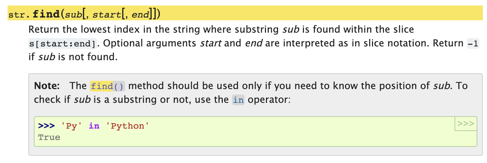

# 파이썬 문법 정리

## `find`: 문자열 검색

### 사용법

```python
string.find(찾을 문자열)
string.find(찾을 문자열, 시작 인덱스)
string.find(찾을 문자열, 시작 인덱스, 끝 인덱스)
```

- 찾는 문자가 존재하면 index 반환
- 없으면 -1 반환
- **<u>이 때 인덱스는 string의 인덱스를 뜻하는 것</u>**
- 시간 복잡도는 정확하게 나온 걸 찾지 못해서 모르겠지만 C++ `string.find()`의 경우 string의 길이가  n, substring의 길이가 m이면 `O(nm)` 이므로 같을 것 같다.

### `in` operator

근데 나는 문자열이 있는 지 아닌지를 찾으려고 find를 썼는데, 파이썬 docs를 보니까 substring의 position을 찾으려고 하는 게 아니면 `in` operator를 쓰라고 한다. (근데 백준에서 봤을 때 시간 차이는 얼마 안난다)



## 입력받기

### 엔터로 구분된 입력 받기

```python
li = [input() for _ in range(n)]
```

- 파이썬에서 언더스코어의 의미는

  1. 인터프리터에서 마지막 값 저장할 때
  2. **<u>don't care: 값 무시하고 싶을 때</u>**
  3. 특별한 의미의 네이밍을 할 때
     - 예를 들어 클래스의 private 변수들에 맨 앞에 붙여서 사용
     - 단 진정한 private를 지원하진 않으므로 직접 가져다 쓰면 가능
  4. 숫자의 자릿수 구분자(자바처럼)

- 이렇게 하면 엔터로 구분된 n개의 문자를 입력받아 li에 리스트로 저장한다.

  - `[]`: 리스트

- 리스트 안에 for문을 한 줄로 작성하여 리스트 작성이 가능하다.

- 이 때 if문도 같이 사용할 수 있다.

  ```python
  li = [i for i in range(0, 10) if i % 2 == 0] # 짝수 리스트
  ```

## 입력 빠르게 받기

- 자바에서 `Scanner`는 버퍼가 1KB로 작고, 내부에서 파싱 과정 등 여러 과정을 거쳐서 더 느리지만, `BufferedReader`는 버퍼가 8KB로 입력이 들어오는 즉시 전달하는 것이 아닌 저장했다가 모아서 전송하기 때문에 속도가 더 빠르다. `BufferedReader`는 `InputSreamReader`에서 버퍼링이 추가된 것이다
- 다만 `Scanner`는 공백, 엔터로 값을 분리할 수 있지만, `BufferedReader`는 엔터로만 입력을 받을 수 있다. 또한 형변환이 일어나지 않고 문자열로만 저장된다. 그리고 개행문자까지 포함된다.

### `sys.stdin.readline()`

- 자바에서 처럼 반복되지 않는 입력을 받을 때는 파이썬 역시 그냥 `input()`을 사용해도 시간 면에서 문제가 없지만, 반복되는 경우 `sys`모듈을 import하고 `sys.stdin.readline()`을 사용해서 입력받아야 한다.

  - [모듈, 패키지, 라이브러리](https://dojang.io/mod/page/view.php?id=2441)

    > 모듈(module)은 각종 변수, 함수, 클래스를 담고 있는 파일이고, 패키지(package)는 여러 모듈을 묶은 것입니다. 파이썬을 설치할 때 다양한 모듈과 패키지가 기본으로 설치됩니다. 만약 기본 모듈과 패키지로 부족하다면 다른 사람이 만든 유명 모듈과 패키지를 설치해서 쓸 수도 있습니다.
    >
    > > **참고** | **모듈, 패키지, 라이브러리** 
    > >
    > > 파이썬을 배우다 보면 모듈, 패키지, 파이썬 표준 라이브러리와 같은 용어를 접하게 되는데 서로 비슷한 개념이지만 약간의 차이가 있습니다.
    > >
    > > 모듈: 특정 기능을 .py 파일 단위로 작성한 것입니다.
    > >
    > > 패키지: 특정 기능과 관련된 여러 모듈을 묶은 것입니다. 패키지는 모듈에 네임스페이스(namespace, 이름공간)를 제공합니다.
    > >
    > > 파이썬 표준 라이브러리: 파이썬에 기본으로 설치된 모듈과 패키지, 내장 함수를 묶어서 파이썬 표준 라이브러리(Python Standard Library, PSL)라 부릅니다.

  - import로 가져오는 건 모듈

- 속도 차이 이유는 버퍼 사이즈 차이로, 한 번에 읽어와서 버퍼 저장(readline) vs. 하나씩 누를 때마다 버퍼에 보관(input)하는 방식으로 다르기 때문이다.

- 사용법

  - 한 개 정수 입력 받기

    ```python
    import sys
    n = int(sys.stdin.readline()) # 개행 문자 제거 + 형변환
    ```

  - 한 줄의 정해진 개수의 정수 입력받기

    ```python
    import sys
    a, b, c = map(int, sys.stdin.readline().split()) # 1 2 3
    ```

  - 한 줄 정수 입력을 리스트로 입력받기

    ```python
    import sys
    li = list(map(int, sys.stdin.readline().split()))
    ```

  - 2차원 리스트 입력받기

    ```python{numberLines: true}
    import sys
    li = []
    n = int(sys.stdin.readline()) # 리스트 행 수
    for i in range(n):
      li.append(list(map(int, sys.stdin.readline())))
      import sys
    li = []
    n = int(sys.stdin.readline()) # 리스트 행 수
    for i in range(n):
      li.append(list(map(int, sys.stdin.readline())))
      import sys
    li = []
    n = int(sys.stdin.readline()) # 리스트 행 수
    for i in range(n):
      li.append(list(map(int, sys.stdin.readline())))
    ```

  - 문자열 n줄 입력받기

    ```python
    import sys
    n = int(sys.stdin.readline())
    li = [sys.stdin.readline().strip() for _ in ragne(n)]
    ```

    - **`strip()`**: 문자열 맨 앞, 맨 끝의 공백(개행)문자 제거
      - `rstrip()`: 문자열 오른쪽의 공백문자 제거
      - `lstrip()`: 문자열 오른쪽의 공백문자 제거

  - 매번 시간 초과났을 때 `input` 대신 `sys.stdin.readline()`로 바꾸는 게 귀찮다면..

    - sys.stdin.readline 함수를 input에 대입하고 input()에 strip()을 붙여주자.. (개행문자 지우기 위함)

    ```python
    import sys
    input = sys.stdin.readline
    # ...
    word = input().strip()
    ```

    - 파이썬의 함수는 일급 객체(**<u>first-class object</u>**)이다.
      - 런타임에 생성 가능
      - 변수나 데이터 구조체의 원소에 할당 가능
      - 함수 인자로 전달 가능
      - 함수의 결과로 반환 가능
    - 따라서 함수 포인터처럼 변수에 할당하여 사용할 수 있다.

```toc
```