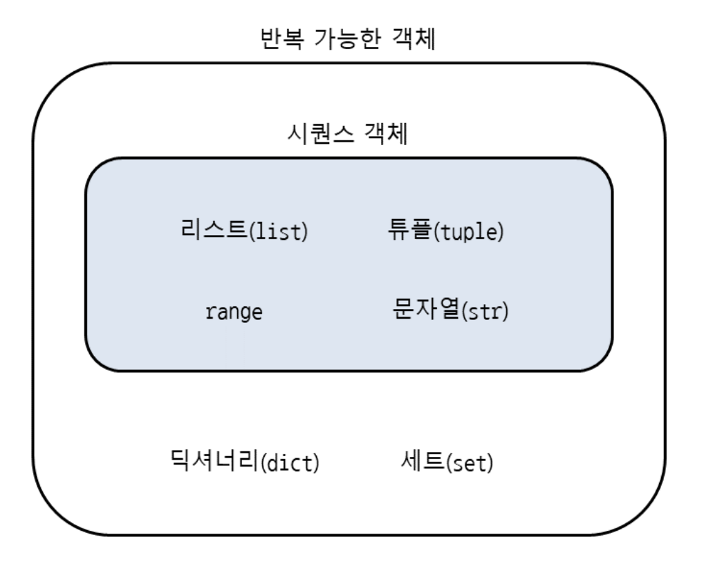

# 리스트 `join`: 원하는 형태로 출력하기

> ### `str.join`(*iterable*)
>
> Return a string which is the concatenation of the strings in *iterable*. A [`TypeError`](https://docs.python.org/3/library/exceptions.html#TypeError) will be raised if there are any non-string values in *iterable*, including `bytes` objects. The separator between elements is the string providing this method.
>
> [python docs](https://docs.python.org/3/library/stdtypes.html?highlight=str%20join#str.join)

- 인자로 iterable한 string을 넣으면 join시켜서 문자열을 만들어준다.

- int형 리스트를 원하는 형태로 join해서 출력해보자.

- 이 때 string join을 해야하므로 int형을 str형으로 변환해줘야한다.

- 따라서 리스트의 요소들을 `str(i)`로 형변환 해주기 위해 map을 활용하자.

  - `map`은 리스트(포함 iterable한 객체)의 요소를 지정된 함수로 처리해준다.

    

    > **참고 |** **시퀀스 객체와 반복 가능한 객체의 차이**
    >
    > 'Unit 11 시퀀스 자료형 활용하기'에서 리스트, 튜플, range, 문자열은 시퀀스 객체라고 했는데, 이 유닛에서는 반복 가능한 객체라고 했습니다. 시퀀스 객체와 반복 가능한 객체의 차이점은 무엇일까요?
    >
    > 다음 그림과 같이 반복 가능한 객체는 시퀀스 객체를 포함합니다.
    >
    > 리스트, 튜플, range, 문자열은 반복 가능한 객체이면서 시퀀스 객체입니다. 하지만, 딕셔너리와 세트는 반복 가능한 객체이지만 시퀀스 객체는 아닙니다. 왜냐하면 시퀀스 객체는 요소의 순서가 정해져 있고 연속적(sequence)으로 이어져 있어야 하는데, 딕셔너리와 세트는 요소(키)의 순서가 정해져 있지 않기 때문입니다. 따라서 시퀀스 객체가 반복 가능한 객체보다 좁은 개념입니다.
    >
    > 즉, 요소의 순서가 정해져 있고 연속적으로 이어져 있으면 시퀀스 객체, 요소의 순서와는 상관없이 요소를 한 번에 하나씩 꺼낼 수 있으면 반복 가능한 객체입니다.
    >
    > [참고](https://dojang.io/mod/page/view.php?id=2405)

```python
# 예를 들어 다음과 같은 리스트를
# [1, 2, 3, 4, 5]
# <1, 2, 3, 4, 5>
# 위의 형태로 출력해야한다면
nums = [i for i in range(1, 6)]
print('{}{}{}'.format('<', ', '.join(map(str, nums)), '>'))
```

# Queue

-  그냥 `list`를 활용하여 Queue, Stack을 사용할 수 있다.

## list 활용

- `pop(index)`: index의 **<u>원소 리턴</u>** + 해당 **<u>원소 삭제</u>**
- 뒤가 아닌 앞에 데이터를 넣고 싶다면 (<u>deque</u>) `insert(index, x)`함수를 이용해서 앞에 데이터를 삽입할 수 있다.

```python
queue = []
queue.append(1)
queue.append(2)
q.pop(0) # 1
```

- 하지만 list는 random accesss에 최적화된 자료구조로 list를 이용해서 pop, insert를 할 경우 성능에 좋지 않다. 만약 앞에서 삭제하거나 삽입한다면 그 뒤 데이터를 모두 당기거나 뒤로 밀어야하므로 `O(N)`의 시간이 들 것이다.

## `pop(index)`?

- index가 없다면 맨 뒤에서 pop한다.
- 그럼 index말고  value로 삭제하고 싶을 땐 어떻게 할까?

## `remove(value)`

```python
>>> li = [1,2,3]
>>> li.pop()
3
>>> li.remove(2)
>>> li
[1]
```

## collections 모듈의 deque

- `deque`를 이용하면 맨 앞 삽입, 삭제를  `O(1)`에 할 수 있다.

```python
>>> from collections import deque
>>> deq = deque([1,2,3])
>>> deq.append(4)
>>> deq
deque([1, 2, 3, 4])
>>> deq.popleft()
1
>>> deq
deque([2, 3, 4])
>>> deq.pop()
4
>>> deq
deque([2, 3])
>>> deq.appendleft(1)
>>> deq
deque([1, 2, 3])
```

## queue 모듈의 Queue

- 맨 앞 pop, 맨 뒤 삽입만 가능한 queue이다.

```python
>>> from queue import Queue
>>> que = Queue()
>>> que.put(1)
>>> que.put(2)
>>> que.put(3)
>>> que.get()
1
>>> que.get()
2
>>> que.empty()
False
>>> que.qsize()
1
>>> que.get()
3
>>> que.qsize()
0
>>> que.empty()
True
```

- 우선순위 큐는... 나중에 알아보도록 하자

# Stack

- Stack 자료구조가 따로 있진 않고 list를 이용한다.
- list 맨 뒤에서 삭제, 삽입하는 건 어차피 `O(1)`이니까 queue처럼 별도의 자료구조가 없는 것 같다.

```python
>>> stack = []
>>> stack.append(1)
>>> stack.append(2)
>>> stack.append(3)
>>> stack[-1] # top
3
>>> stack
[1, 2, 3]
>>> stack.pop()
3
>>> stack
[1, 2]
```


# [딕셔너리](https://wikidocs.net/16)

- key-value 자료구조이다.
- 이 때 key가 int일 수도 있고 문자열일 수도 있고 리스트일 수도 있고 다른 객체일 수 있다.

```python
>>> a = {1: 'a'}
>>> a[2] = 'b'
>>> a
{1: 'a', 2: 'b'}
>>> a['name'] = 'pey'
>>> a
{1: 'a', 2: 'b', 'name': 'pey'}
>>> a[3] = [1,2,3]
>>> a
{1: 'a', 2: 'b', 'name': 'pey', 3: [1, 2, 3]}
```

## `del` 삭제

```python
>>> del a[1]
>>> a
{2: 'b', 'name': 'pey', 3: [1, 2, 3]}
```

### list

- list 역시 `del`을 이용하여 삭제 가능하다.

| 종류     | 내용                                      |
| -------- | ----------------------------------------- |
| clear()  | 모든 요소 삭제                            |
| pop()    | 지정한 위치 값을 삭제하고 리턴            |
| remove() | 지정한 위치 값과 같은 값은 (처음) 값 삭제 |
| del      | 위치 또는 범위를 지정 삭제                |

- [참고](https://ponyozzang.tistory.com/587)

```python
>>> li = list(range(10))
>>> li
[0, 1, 2, 3, 4, 5, 6, 7, 8, 9]
>>> del li[5] # 5번째 삭제
>>> li
[0, 1, 2, 3, 4, 6, 7, 8, 9]
>>> del li[:2] # 처음 ~ 2번째 전까지, 즉 0, 1번째 요소 삭제
>>> li
[2, 3, 4, 6, 7, 8, 9]
>>> del li[1:-2] # 1번째 ~ 뒤에서 2번째 전까지, 즉 여기선 1번째 ~ 4번째
>>> li
[2, 8, 9]
>>> del li[::2] # 처음부터 끝까지 2의 간격으로 삭제 
>>> li
[8]
```


## 주의

- key가 중복된다면 하나를 제외하고 모두 무시한다. 또한 **key에 list는 쓸 수 없지만 튜플은 쓸 수 있다**.
- **<u>key에는 immutable한 값만 쓸 수 있기 때문이다.</u>**

## 각종 함수

- key가 있는 지 확인하기

  - 그냥 `in`을 활용하여 `key in dict`로 확인 가능하다.

- key, value 값들 얻기

  - `dict.keys()`

  - `dict.values()`

  - `dict.items()`: 각 key, value를 튜플로 묶은 값을 `dict_items` 객체로 리턴한다.

    ```python
    >>> a.items()
    dict_items([('name', 'pey'), ('phone', '0119993323'), ('birth', '1118')])
    ```

- 다 지우기

  `clear()`

- value 얻기

  `dict.get(key)`

  - 이 때 `dict[key]`를 사용한다면 key가 없을 때 오류가 나지만, `dict.get(key)`를 이용하면 `None`이 리턴된다.

    ```python
    >>> a = {'name':'pey', 'phone':'0119993323', 'birth': '1118'}
    >>> print(a.get('nokey'))
    None
    >>> print(a['nokey'])
    Traceback (most recent call last):
      File "<stdin>", line 1, in <module>
    KeyError: 'nokey'
    ```

    


```toc

```

